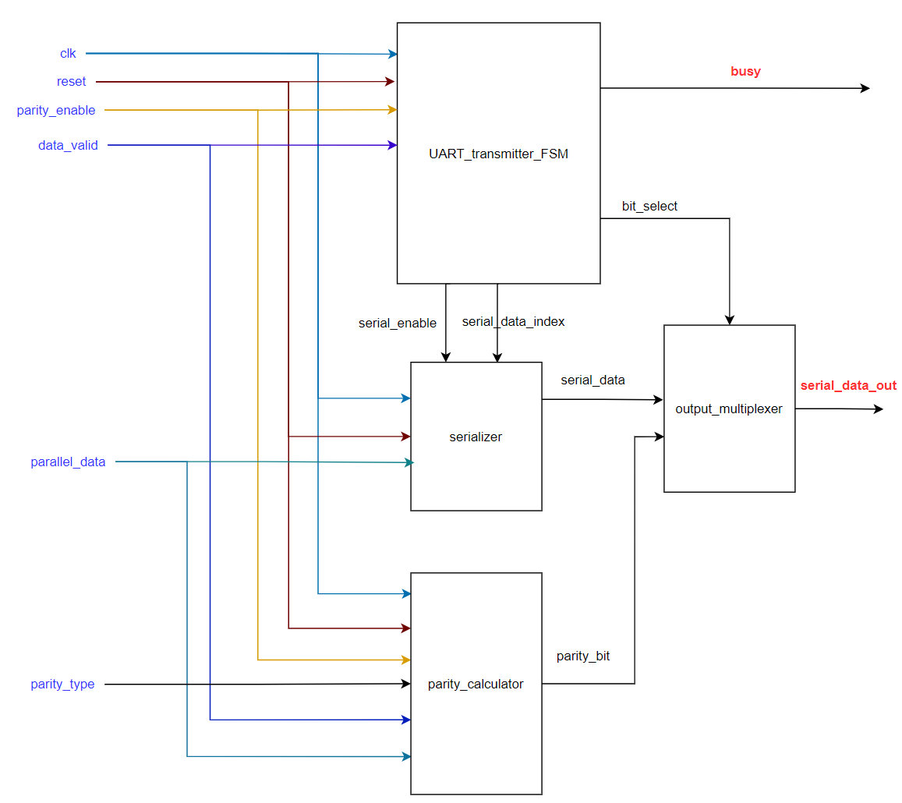

# PrUcess
PrUcess is a processing unit that executes commands (arithmetic &amp; logic operations, memory read &amp; write operations) which are received from an external source through UART protocol.

## System Modules

### UART Transmitter

#### Block Diagram

#### Port Description
<table>
    <tr>
        <th>Port</th>
        <th>Direction</th>
        <th>Description</th>
    </tr>
    <tr>
        <td>clk</td>
        <td>input</td>
        <td>Generated clock produced from the clock divider whose source clock is UART clock</td>
    </tr>
    <tr>
        <td>reset</td>
        <td>input</td>
        <td>Global active low asynchronous reset after synchronization</td>
    </tr>
    <tr>
        <td>parity_type</td>
        <td>input</td>
        <td>Signal to indicate the parity type (1 for odd, 0 for even)</td>
    </tr>
    <tr>
        <td>parity_enable</td>
        <td>input</td>
        <td>Signal to enable the transmission of the parity bit in the frame</td>
    </tr>
    <tr>
        <td>data_valid</td>
        <td>input</td>
        <td>Signal that indicates that there exist data to be transmitted</td>
    </tr>
    <tr>
        <td>parallel_data</td>
        <td>input</td>
        <td>The data to be transmitted by the UART transmitter, and its size is 1-byte</td>
    </tr>
    <tr>
        <td>serial_data_out</td>
        <td>output</td>
        <td>The output of the transmitter (It is also the output of the mux that selects between start, serial data, parity, or stop bits according to the state of the transmission)</td>
    </tr>
    <tr>
        <td>busy</td>
        <td>output</td>
        <td>Signal to indicate the parity type (1 for odd, 0 for even)</td>
    </tr>
</table>