<table>
    <tr>
        <th align="left">Port</th>
        <th>Direction</th>
        <th>Width</th>
        <th>Description</th>
    </tr>
    <tr>
        <td>FILLER</td>
        <td>FILLER</td>
        <td align="center">FILLER</td>
        <td>FILLER</td>
    </tr>
    <tr>
        <td>FILLER</td>
        <td>FILLER</td>
        <td align="center">FILLER</td>
        <td>FILLER</td>
    </tr>
    <tr>
        <td>FILLER</td>
        <td>FILLER</td>
        <td align="center">FILLER</td>
        <td>FILLER</td>
    </tr>
    <tr>
        <td>FILLER</td>
        <td>FILLER</td>
        <td align="center">FILLER</td>
        <td>FILLER</td>
    </tr>
    <tr>
        <td>FILLER</td>
        <td>FILLER</td>
        <td align="center">FILLER</td>
        <td>FILLER</td>
    </tr>
    <tr>
        <td>FILLER</td>
        <td>FILLER</td>
        <td align="center">FILLER</td>
        <td>FILLER</td>
    </tr>
    <tr>
        <td>FILLER</td>
        <td>FILLER</td>
        <td align="center">FILLER</td>
        <td>FILLER</td>
    </tr>
    <tr>
        <td>FILLER</td>
        <td>FILLER</td>
        <td align="center">FILLER</td>
        <td>FILLER</td>
    </tr>
</table>

# PrUcess (Processing unit through UART)

Pr**U**cess is a **processing** unit that executes commands (arithmetic &amp; logical operations, register file read &amp; write operations) which are received from an external source through **UART** receiver module and it tranmsits the commands' results through the **UART** transmitter module.

UART is a standard serial communication protocol widely used in many applications. Oversampling is a technique used in UART receivers to improve the accuracy and reliability of the received data. In a UART receiver, data is received as a series of binary bits that are transmitted asynchronously with respect to a clock signal. To correctly interpret the received data, the receiver must sample the incoming signal at the correct time to capture the correct value of each bit. Oversampling involves sampling the incoming signal at a higher frequency than the baud rate of the transmitted data. This means that multiple samples are taken during the transmission of each bit, allowing the receiver to more accurately determine the timing and value of each bit. Oversampling also helps to mitigate the effects of noise and other signal distortions that can cause errors in the received data. By taking multiple samples of each bit, the receiver can detect and correct for these errors, improving the overall reliability of the data transmission.

The system includes two asynchronous clock domains (reference clock domain and UART clock domain). The command is received by the UART receiver, then it is sent to the system controller through a synchronizer (to solve the CDC issues) to decode and execute the command and then it sends the result to the UART transmitter through a synchronizer which will finally transmit it serially.

#### System's Parameters

<table>
    <tr>
        <th align="left">Parameter</th>
        <th>Default Value</th>
        <th>Description</th>
    </tr>
    <tr>
        <td>DATA_WIDTH</td>
        <td align="center">8</td>
        <td>It is the size of: registers, ALU operands, UART transmitter frames, and UART receiver frames.</td>
    </tr>
    <tr>
        <td>REGISTER_FILE_DEPTH</td>
        <td align="center">16</td>
        <td>The number of registers in the register file.</td>
    </tr>
    <tr>
        <td>SYNCHRONIZER_STAGE_COUNT</td>
        <td align="center">2</td>
        <td>The number of stages in a synchronizer.</td>
    </tr>
    <tr>
        <td>oversampling_prescale</td>
        <td align="center">the default value after resetting the system is 8</td>
        <td>The ratio between the frequency of the UART receiver clock and the frequency of the UART transmitter clock.</td>
    </tr>
</table>

#### System's Clock Domains

<table>
    <tr>
        <th align="left">Clock Domain</th>
        <th>Clock Names</th>
        <th>Modules</th>
        <th>Frequency</th>
        <th>Periodic Time</th>
    </tr>
    <tr>
        <td>Reference clock domain</td>
        <td>
            <ul>
                <li>reference_clk</li>
                <li>ALU_clk</li>
            </ul>
        </td>
        <td>
            <ul>
                <li>System controller</li>
                <li>ALU</li>
                <li>Register file</li>
            </ul>
        </td>
        <td align="center">Reference clock frequency = ALU clock frequency = 40 MHz</td>
        <td>Reference clock period = ALU clock period = 25 ns</td>
    </tr>
    <tr>
        <td>UART clock domain</td>
        <td>
            <ul>
                <li>UART_clk</li>
                <li>UART_transmitter_clk</li>
            </ul>
        </td>
        <td>
            <ul>
                <li>UART transmitter</li>
                <li>UART receiver</li>
                <li>Clock divider</li>
            </ul>
        </td>
        <td align="center">
            <ul>
                <li>UART transmitter clock frequency = 115.2 KHz (standard baud rate)</li>
                <li>UART clock frequency = oversampling_prescale * 115.2 KHz = 32 * 115.2 KHz = 3.6864 MHz</li>
            </ul>
        </td>
        <td>
            <ul>
                UART clock period = 271 ns
            </ul>
        </td>
    </tr>
</table>

Note that the oversampling prescale can have the values (8, 16, or 32) but 32 is used in the simulations and backend flow to ensure that the UART recceiver is functioning correctly in the worst case (highest clock frequency).

#### System's Components:
<ol>
    <li>UART: It consists of UART receiver which receives the commands and UART transmitter that transmits the commands' results.</li>
    <li>Clock divider: An integer clock divider which can divide the source clock up to division ratio of 32. It is used to divide the UART clock to produce UART transmitter clock with division ratio equal oversampling prescale.</li>
    <li>ALU: It executes arithmetic and logical operations.</li>
    <li>Clock gating cell: It is used to gate the ALU clock because there is significant time in which the ALU is not in operation (because the ALU operates on a very fast clock compared with the UART, so it waits long time to receive a new command).</li>
    <li>Register file.</li>
    <li>System controller: It is the main controller of the system. It consists of UART transmitter controller and UART receiver controller. The UART transmitter controller controls the UART transmitter by sending to it the data to be sent serially after it is ready (ALU result or register file data). The UART receiver controller controls the ALU and register file control signals based on the received frames from the UART receiver.</li>
    <li>Reset synchronizer: It is used to synchronize the global reset to all clock domains.</li>
    <li>Bus synchronizer: This module can be used to synchronize a single bit or a grey encoded bus between two asynchronous clock domains. It is a generic module (setting BUS_WIDTH = 1, means that it is a single bit synchronizer).</li>
    <li>Data synchronizer: It is used to synchronize a bus by using a bit synchronizer and pulse generator to synchronize the bus's data valid signal.</li>
</ol>

#### ALU Operations:
<ol>
    <li>Addition (+)</li>
    <li>Subtraction (-)</li>
    <li>Multiplication (*)</li>
    <li>Division (/)</li>
    <li>Bit-wise AND (&)</li>
    <li>Bit-wise OR (|)</li>
    <li>Bit-wise NAND (~&)</li>
    <li>Bit-wise NOR (~|)</li>
    <li>Bit-wise XOR (^)</li>
    <li>Bit-wise XNOR (~^)</li>
    <li>Is equal (==)</li>
    <li>Is greater than (>)</li>
    <li>Is less than (<)</li>
    <li>Shift right (>>1)</li>
    <li>Shift left (<<1)</li>
</ol>

#### System's Commands:
<ul>
    <li>Register file write command. This command consists of 3 frames as follows: 
        <ol>
            <li>Command opcode (0xAA)</li>
            <li>Register file write address</li>
            <li>Register file write data</li>
        </ol>
    </li>
    <li>Register file read command. This command consists of 2 frames as follows: 
        <ol>
            <li>Command opcode (0xBB)</li>
            <li>Register file read address</li>
        </ol>
    </li>
    <li>ALU operation with operands command. The operands of the ALU are connected to the first two registers of the register file, so to execute this command: the operands are first written to the first two registers in the register file then the result is evaluated. This command consists of 4 frames as follows: 
        <ol>
            <li>Command opcode (0xCC)</li>
            <li>Operand A</li>
            <li>Operand B</li>
            <li>ALU function</li>
        </ol>
    </li>
    <li>ALU operation without operands command. This command executes the ALU operation on the stored values in the first two registers in the register file directly. This command consists of 2 frames as follows: 
        <ol>
            <li>Command opcode (0xDD)</li>
            <li>ALU function</li>
        </ol>
    </li>
</ul>

In all ALU commands, the UART transmitter sends two consecutive frames (becuase the size of the ALU result is double the size of the frame).

#### The register file is used to configure the whole system:
<ul>
    <li>The parity configuration of UART (parity enable and parity type).</li>
    <li>The oversampling prescale (division ratio) of the UART receiver.</li>
</ul>

Note that the mentioned configurations are outputs from the register file (reference clock domain) and they are inputs to blocks that operates on UART clock (i.e. Metastability may occur becuase the source and destination domains are asynchronous to one another), however there is no synchronizers used to synchronize those signals because they are **Quasi-static signals** (they are effectively stable for long periods of time. Such domain crossings do not require synchronizers in the destination domain, because they are held long enough to be captured by even the slowest clock domains without the risk of metastability).

## System Top Level Module

### Block Diagram

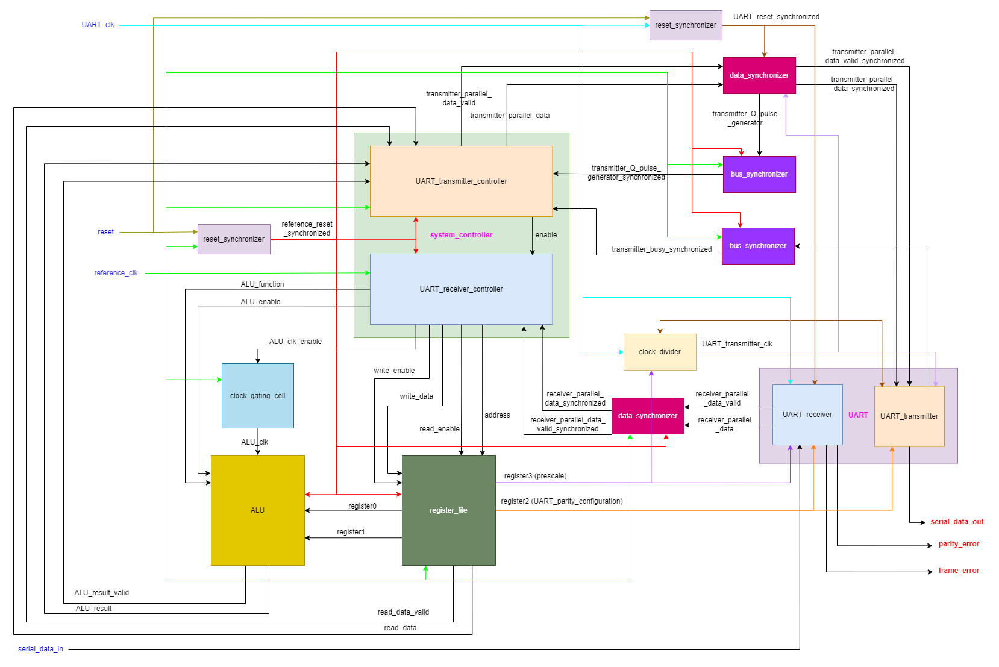

#### Port Description

<table>
    <tr>
        <th align="left">Port</th>
        <th>Direction</th>
        <th>Width</th>
        <th>Description</th>
    </tr>
    <tr>
        <td>reference_clk</td>
        <td>input</td>
        <td align="center">1</td>
        <td>The main clock of the system.</td>
    </tr>
    <tr>
        <td>UART_clk</td>
        <td>input</td>
        <td align="center">1</td>
        <td>UART clock (the clock of the UART receiver).</td>
    </tr>
    <tr>
        <td>reset</td>
        <td>input</td>
        <td align="center">1</td>
        <td>Unsynchronized global active low asynchronous reset.</td>
    </tr>
    <tr>
        <td>serial_data_in</td>
        <td>input</td>
        <td align="center">1</td>
        <td>The data which is received serially by the UART receiver.</td>
    </tr>
    <tr>
        <td>serial_data_out</td>
        <td>output</td>
        <td align="center">1</td>
        <td>The output of the UART transmitter (It is also the output of the mux that select between start, serial data, parity, or stop bits according to the state of the transmission).</td>
    </tr>
    <tr>
        <td>parity_error</td>
        <td>output</td>
        <td align="center">1</td>
        <td>A signal to indicate that there is parity mismatch between the received parity bit and the calculated parity bit.</td>
    </tr>
    <tr>
        <td>frame_error</td>
        <td>output</td>
        <td align="center">1</td>
        <td>A signal to indicate that the start bit or the stop bit was incorrect.</td>
    </tr>
</table>

## System Submodules

### UART Transmitter

#### Top Level Module

#### UART Transmitter Frame Types

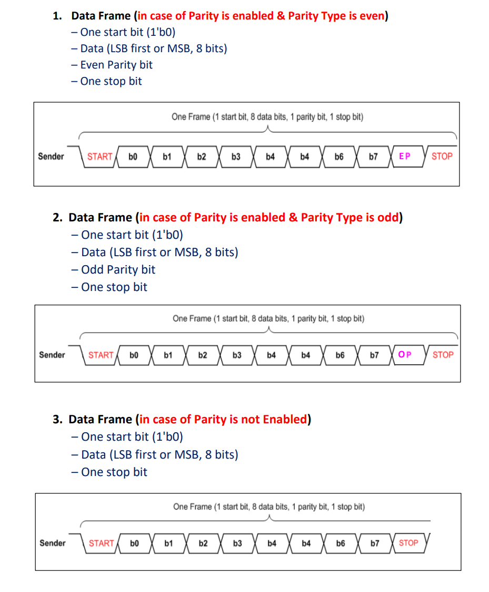

#### Block Diagram

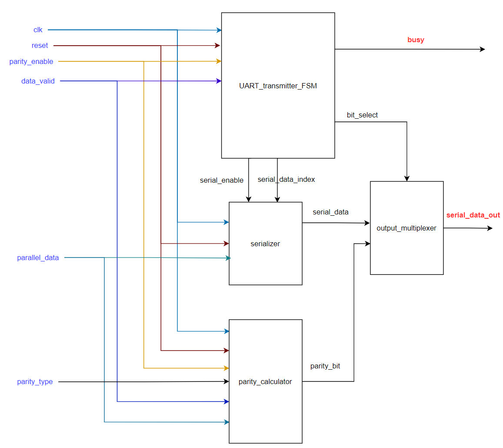

#### Port Description

<table>
    <tr>
        <th align="left">Port</th>
        <th>Direction</th>
        <th>Width</th>
        <th>Description</th>
    </tr>
    <tr>
        <td>clk</td>
        <td>input</td>
        <td align="center">1</td>
        <td>Generated clock produced from the clock divider whose source clock is UART clock.</td>
    </tr>
    <tr>
        <td>reset</td>
        <td>input</td>
        <td align="center">1</td>
        <td>Global active low asynchronous reset after synchronization.</td>
    </tr>
    <tr>
        <td>parity_type</td>
        <td>input</td>
        <td align="center">1</td>
        <td>A signal to indicate the parity type (1 for odd, 0 for even).</td>
    </tr>
    <tr>
        <td>parity_enable</td>
        <td>input</td>
        <td align="center">1</td>
        <td>A signal to enable the transmission of the parity bit in the frame.</td>
    </tr>
    <tr>
        <td>data_valid</td>
        <td>input</td>
        <td align="center">1</td>
        <td>A signal that indicates that there exist data to be transmitted.</td>
    </tr>
    <tr>
        <td>parallel_data</td>
        <td>input</td>
        <td align="center">DATA_WIDTH (default value is 8)</td>
        <td>The data to be transmitted by the UART transmitter.</td>
    </tr>
    <tr>
        <td>serial_data_out</td>
        <td>output</td>
        <td align="center">1</td>
        <td>The output of the transmitter (It is also the output of the mux that selects between start, serial data, parity, or stop bits according to the state of the transmission).</td>
    </tr>
    <tr>
        <td>busy</td>
        <td>output</td>
        <td align="center">1</td>
        <td>A signal that indicates that the transmitter is currently in operation and it can't transmit new data.</td>
    </tr>
</table>

#### UART Transmitter Finite State Machine (FSM)

##### FSM

Note that if any omitted condition occurs, the current state won't change.

This FSM controls the following output ports according to the current state: busy, serial_enable, bit_select.

##### Port Description

<table>
    <tr>
        <th align="left">Port</th>
        <th>Direction</th>
        <th>Width</th>
        <th>Description</th>
    </tr>
    <tr>
        <td>clk</td>
        <td>input</td>
        <td align="center">1</td>
        <td> Generated clock produced from the clock divider whose source clock is UART clock.</td>
    </tr>
    <tr>
        <td>reset</td>
        <td>input</td>
        <td align="center">1</td>
        <td>Global active low asynchronous reset after synchronization.</td>
    </tr>
    <tr>
        <td>parity_enable</td>
        <td>input</td>
        <td align="center">1</td>
        <td>A signal to enable the transmission of the parity bit in the frame.</td>
    </tr>
    <tr>
        <td>data_valid</td>
        <td>input</td>
        <td align="center">1</td>
        <td>A signal that indicates that there exist data to be transmitted.</td>
    </tr>
    <tr>
        <td>serial_enable</td>
        <td>output</td>
        <td align="center">1</td>
        <td>A signal to enable the operation of the serializer.</td>
    </tr>
    <tr>
        <td>bit_select</td>
        <td>output</td>
        <td align="center">2</td>
        <td>The output mux selection bits that selects the output  bit (start bit, serial data bit, parity bit, or stop bit). The value of those selection bits is decided according to the current state of the transmission.</td>
    </tr>
    <tr>
        <td>seial_data_index</td>
        <td>output</td>
        <td align="center">log2(DATA_WIDTH) (default value is 3)</td>
        <td>A number between 0 and 7 that indicates the index of the bit to be transmitted serially.</td>
    </tr>
    <tr>
        <td>busy</td>
        <td>output</td>
        <td align="center">1</td>
        <td>A signal that indicates that the transmitter is currently in operation and it can't transmit new data.</td>
    </tr>
</table>

#### Serializer

It produces serial bits from the parallel data (from LSB to MSB) according to the input index.

##### Port Description
<table>
    <tr>
        <th align="left">Port</th>
        <th>Direction</th>
        <th>Width</th>
        <th>Description</th>
    </tr>
    <tr>
        <td>clk</td>
        <td>input</td>
        <td align="center">1</td>
        <td> Generated clock produced from the clock divider whose source clock is UART clock.</td>
    </tr>
    <tr>
        <td>reset</td>
        <td>input</td>
        <td align="center">1</td>
        <td>Global active low asynchronous reset after synchronization.</td>
    </tr>
    <tr>
        <td>parallel_data</td>
        <td>input</td>
        <td align="center">DATA_WIDTH (default value is 8)</td>
        <td>The data to be transmitted by the UART transmitter.</td>
    </tr>
    <tr>
        <td>serial_enable</td>
        <td>input</td>
        <td align="center">1</td>
        <td>A signal to enable the operation of the serializer.</td>
    </tr>  
    <tr>
        <td>serial_data_index</td>
        <td>input</td>
        <td align="center">log2(DATA_WIDTH) (default value is 3)</td>
        <td>A number between 0 and 7 that indicates the index of the bit to be transmitted serially.</td>
    </tr>
    <tr>
        <td>serial_data</td>
        <td>output</td>
        <td align="center">1</td>
        <td>The bit that is serially transmitted from the UART transmitter.</td>
    </tr>
</table>

#### Parity Calculator

It calculates the parity bit according to the parity type.

##### Port Description
<table>
    <tr>
        <th align="left">Port</th>
        <th>Direction</th>
        <th>Width</th>
        <th>Description</th>
    </tr>
    <tr>
        <td>clk</td>
        <td>input</td>
        <td align="center">1</td>
        <td>Generated clock produced from the clock divider whose source clock is UART clock.</td>
    </tr>
    <tr>
        <td>reset</td>
        <td>input</td>
        <td align="center">1</td>
        <td>Global active low asynchronous reset after synchronization.</td>
    </tr>
    <tr>
        <td>parity_type</td>
        <td>input</td>
        <td align="center">1</td>
        <td>A signal to indicate the parity type (1 for odd, 0 for even).</td>
    </tr>
    <tr>
        <td>parity_enable</td>
        <td>input</td>
        <td align="center">1</td>
        <td>A signal to enable the transmission of the parity bit in the frame.</td>
    </tr>
    <tr>
        <td>parallel_data</td>
        <td>input</td>
        <td align="center">DATA_WIDTH (default value is 8)</td>
        <td>The data to be transmitted by the UART transmitter.</td>
    </tr>
    <tr>
        <td>parity_bit</td>
        <td>output</td>
        <td align="center">1</td>
        <td>The parity bit of the parallel data to be transmitted.</td>
    </tr>
</table>

#### Output Multiplexer

It selects between (start bit, serial data bit, parity bit, or stop bit) according to the current state of trasnmission.

##### Port Description

<table>
    <tr>
        <th align="left">Port</th>
        <th>Direction</th>
        <th>Width</th>
        <th>Description</th>
    </tr>
    <tr>
        <td>bit_select</td>
        <td>input</td>
        <td align="center">2</td>
        <td>The output mux selection bits that selects the output bit (start bit, serial data bit, parity bit, or stop bit).</td>
    </tr>
    <tr>
        <td>serial_data</td>
        <td>input</td>
        <td align="center">1</td>
        <td>The bit that is serially transmitted from the UART transmitter (i.e. the output bit from the serializer).</td>
    </tr>  
    <tr>
        <td>parity_bit</td>
        <td>input</td>
        <td align="center">1</td>
        <td>The parity bit of the parallel data to be transmitted.</td>
    </tr>
    <tr>
        <td>mux_out</td>
        <td>output</td>
        <td align="center">1</td>
        <td>The output of the mux that selects between start, serial data, parity, or stop bits according to the state of the transmission.</td>
    </tr>
</table>

### UART Receiver

#### Top Level Module

##### Block Diagram

##### Port Description

<table>
    <tr>
        <th align="left">Port</th>
        <th>Direction</th>
        <th>Width</th>
        <th>Description</th>
    </tr>
    <tr>
        <td>clk</td>
        <td>input</td>
        <td align="center">1</td>
        <td>UART clock.</td>
    </tr>
    <tr>
        <td>reset</td>
        <td>input</td>
        <td align="center">1</td>
        <td>Global active low asynchronous reset after synchronization.</td>
    </tr>
    <tr>
        <td>parity_type</td>
        <td>input</td>
        <td align="center">1</td>
        <td>A signal to indicate the parity type (1 for odd, 0 for even).</td>
    </tr>
    <tr>
        <td>parity_enable</td>
        <td>input</td>
        <td align="center">1</td>
        <td>A signal to enable the transmission of the parity bit in the frame.</td>
    </tr>
    <tr>
        <td>prescale</td>
        <td>input</td>
        <td align="center">6</td>
        <td>The ratio between the frequency of the receiver and the frequecy of the transmitter (The avaialable oversampling_prescale values are: 8, 16, 32).</td>
    </tr>
    <tr>
        <td>serial_data_in</td>
        <td>input</td>
        <td align="center">1</td>
        <td>The data which is received serially.</td>
    </tr>
    <tr>
        <td>data_valid</td>
        <td>output</td>
        <td align="center">1</td>
        <td>A signal to indicate that the received data was free of errors.</td>
    </tr>
    <tr>
        <td>parallel_data</td>
        <td>output</td>
        <td align="center">DATA_WIDTH (default value is 8)</td>
        <td>The data which is received serially bit by bit.</td>
    </tr>
    <tr>
        <td>parity_error</td>
        <td>output</td>
        <td align="center">1</td>
        <td>A signal to indicate that there is parity mismatch between the received parity bit and the calculated parity bit.</td>
    </tr>
    <tr>
        <td>frame_error</td>
        <td>output</td>
        <td align="center">1</td>
        <td> A signal to indicate that the start bit or the stop bit was incorrect.</td>
    </tr>
</table>

#### UART Receiver Finite State Machine (FSM)

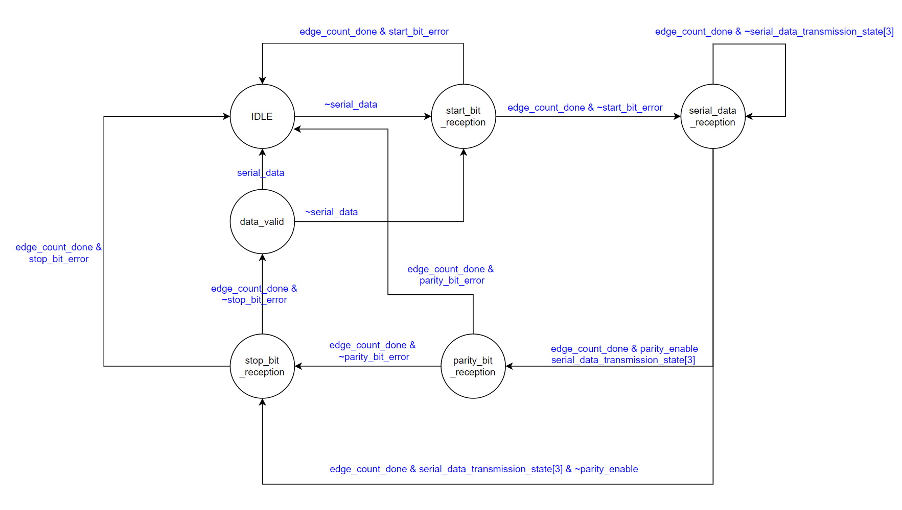

Note that if any omitted condition occurs, the current state won't change.

### Clock Divider

#### Port Description

<table>
    <tr>
        <th align="left">Port</th>
        <th>Direction</th>
        <th>Width</th>
        <th>Description</th>
    </tr>
    <tr>
        <td>reference_clk</td>
        <td>input</td>
        <td align="center">1</td>
        <td>The source clock (UART clock).</td>
    </tr>
    <tr>
        <td>reset</td>
        <td>input</td>
        <td align="center">1</td>
        <td>Global active low asynchronous reset after synchronization.</td>
    </tr>
    <tr>
        <td>clk_divider_enable</td>
        <td>input</td>
        <td align="center">1</td>
        <td>An enable signal for the clock divider.</td>
    </tr>
    <tr>
        <td>division_ratio</td>
        <td>input</td>
        <td align="center">6</td>
        <td>The division ratio of the clock divider (oversampling_prescale), it is connected to register_file[3].</td>
    </tr>
    <tr>
        <td>output_clk</td>
        <td>output</td>
        <td align="center">1</td>
        <td>The output divided clock (UART_transmitter_clk).</td>
    </tr>
</table>

### Clock Gating Cell

#### Logic Diagram

Latch-based clock gating cell:

This module is replaced by the integrated clock gating cell (ICG) from the standard cell library. ICG is a full custom cell whose path delays are well balanced which eliminates the occurrence of pulse clipping and spurious clocking issues. The replacement procedure is done automatically using the `place_ICG_cell.tcl` script to ease the process of placement (in the backend flow) and removal (in the functional simulation and verification) of the ICG cell.

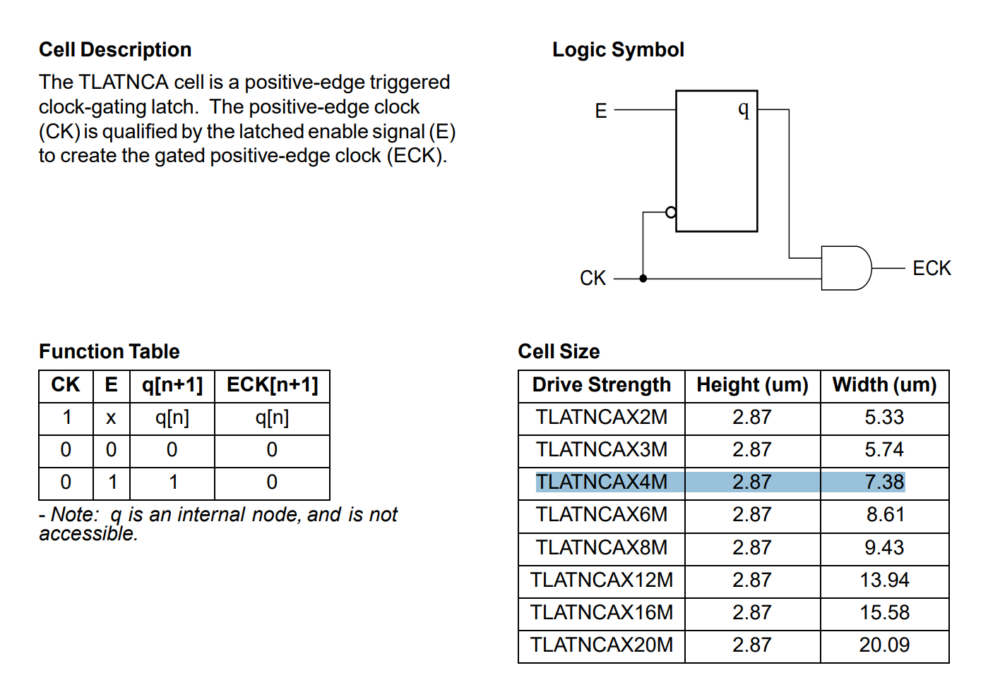

#### Port Description

<table>
    <tr>
        <th align="left">Port</th>
        <th>Direction</th>
        <th>Width</th>
        <th>Description</th>
    </tr>
    <tr>
        <td>clk</td>
        <td>input</td>
        <td align="center">1</td>
        <td>The source clock to be gated (reference clock).</td>
    </tr>
    <tr>
        <td>clk_enable</td>
        <td>input</td>
        <td align="center">1</td>
        <td>An enable signal for the clock gating.</td>
    </tr>
    <tr>
        <td>gated_clk</td>
        <td>output</td>
        <td align="center">1</td>
        <td>The output gated clock (ALU clock).</td>
    </tr>
</table>

### ALU

#### Logic Diagram

'ALU result' logic diagram:

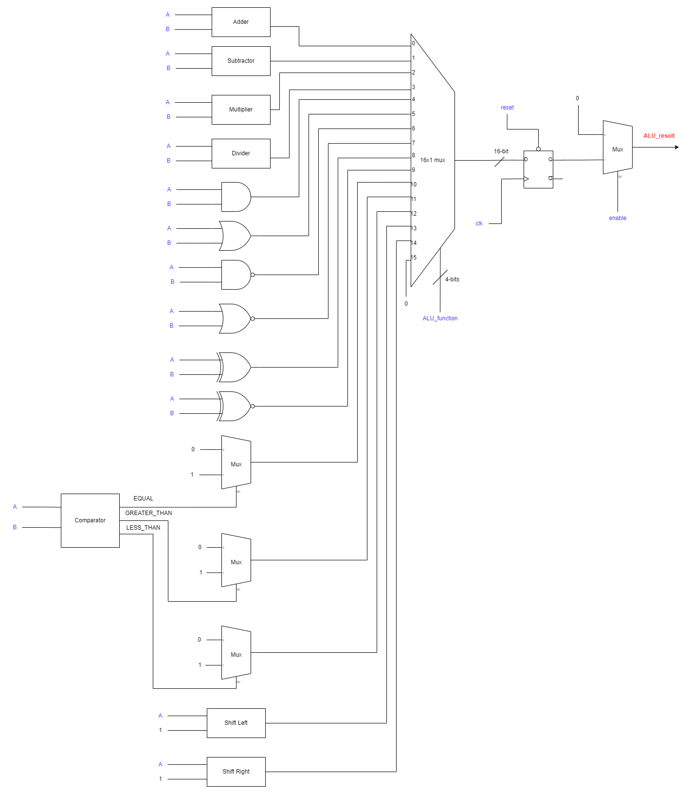

'ALU result valid' logic diagram:

#### Port Decription

<table>
    <tr>
        <th align="left">Port</th>
        <th>Direction</th>
        <th>Width</th>
        <th>Description</th>
    </tr>
    <tr>
        <td>clk</td>
        <td>input</td>
        <td align="center">1</td>
        <td>The ALU result is synchronized to this clock (reference clock).</td>
    </tr>
    <tr>
        <td>reset</td>
        <td>input</td>
        <td align="center">1</td>
        <td>Global active low asynchronous reset after synchronization.</td>
    </tr>
    <tr>
        <td>A</td>
        <td>input</td>
        <td align="center">DATA_WIDTH (default value is 8)</td>
        <td>ALU's first operand (it is connected to register_file[0]).</td>
    </tr>
    <tr>
        <td>B</td>
        <td>input</td>
        <td align="center">DATA_WIDTH (default value is 8)</td>
        <td>ALU's second operand (it is connected to register_file[1]).</td>
    </tr>
    <tr>
        <td>ALU_function</td>
        <td>input</td>
        <td align="center">4</td>
        <td>A binary code to determine the function of the ALU.</td>
    </tr>
    <tr>
        <td>enable</td>
        <td>input</td>
        <td align="center">1</td>
        <td>ALU enable signal.</td>
    </tr>
    <tr>
        <td>ALU_result_valid</td>
        <td>output</td>
        <td align="center">1</td>
        <td>A signal to indicate the ALU result is valid.</td>
    </tr>
    <tr>
        <td>ALU_result</td>
        <td>output</td>
        <td align="center">2 * DATA_WIDTH (default value is 16)</td>
        <td>The result of the ALU.</td>
    </tr>
</table>

### Register File

#### Port Decription

<table>
    <tr>
        <th align="left">Port</th>
        <th>Direction</th>
        <th>Width</th>
        <th>Description</th>
    </tr>
    <tr>
        <td>clk</td>
        <td>input</td>
        <td align="center">1</td>
        <td>The read and write operations are synchronized to this clock (reference clock).</td>
    </tr>
    <tr>
        <td>reset</td>
        <td>input</td>
        <td align="center">1</td>
        <td>Global active low asynchronous reset after synchronization.</td>
    </tr>
    <tr>
        <td>address</td>
        <td>input</td>
        <td align="center">log2(REGISTER_FILE_DEPTH) (default value is 4)</td>
        <td>The address of the register to be read from or written to.</td>
    </tr>
    <tr>
        <td>write_enable</td>
        <td>input</td>
        <td align="center">1</td>
        <td>A signal to enable the write operation.</td>
    </tr>
    <tr>
        <td>write_data</td>
        <td>input</td>
        <td align="center">DATA_WIDTH (default value is 8)</td>
        <td>The data to be written in the given address.</td>
    </tr>
    <tr>
        <td>read_enable</td>
        <td>input</td>
        <td align="center">1</td>
        <td>A signal to enable the read operation.</td>
    </tr>
    <tr>
        <td>read_data_valid</td>
        <td>output</td>
        <td align="center">1</td>
        <td>A signal to indicate that the data on the 'read_data' bus is a valid data.</td>
    </tr>
    <tr>
        <td>read_data</td>
        <td>output</td>
        <td align="center">DATA_WIDTH (default value is 8)</td>
        <td>The data read from the given address.</td>
    </tr>
    <tr>
        <td>register0</td>
        <td>output</td>
        <td align="center">DATA_WIDTH (default value is 8)</td>
        <td>The first register in the register file, it stores the first operand of the ALU.</td>
    </tr>
    <tr>
        <td>register1</td>
        <td>output</td>
        <td align="center">DATA_WIDTH (default value is 8)</td>
        <td>The second register in the register file, it stores the second operand of the ALU.</td>
    </tr>
    <tr>
        <td>register2</td>
        <td>output</td>
        <td align="center">DATA_WIDTH (default value is 8)</td>
        <td>The third register in the register file, it stores the parity configuration (parity enable and parity type) of the UART.</td>
    </tr>
    <tr>
        <td>register3</td>
        <td>output</td>
        <td align="center">DATA_WIDTH (default value is 8)</td>
        <td>The fourth register in the register file, it stores the value of the oversampling prescale used in the clock divider (it is the ratio between the clock frequency of the UART receiver and the clock frequency of the UART transmitter).</td>
    </tr>
</table>

### Bus Synchronizer

It acts as a gray encoded bus synchronizer or a single bit synchronizer according to the value of the BUS_WIDTH parameter. It consists of multiple registers (single bit or multiple bits) connected in a cascaded scheme, and the number of stages is parametrized with a default value of 2.

#### Logic Diagram

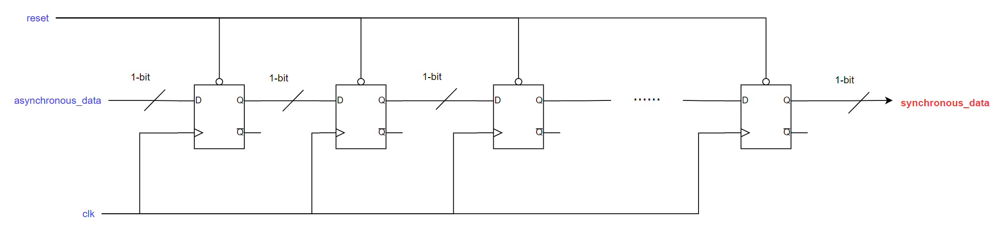

#### Port Description
<table>
    <tr>
        <th align="left">Port</th>
        <th>Direction</th>
        <th>Width</th>
        <th>Description</th>
    </tr>
    <tr>
        <td>clk</td>
        <td>input</td>
        <td align="center">1</td>
        <td>The clock of the destination domain.</td>
    </tr>
    <tr>
        <td>reset</td>
        <td>input</td>
        <td align="center">1</td>
        <td>Global active low asynchronous reset of the destination domain after synchronization.</td>
    </tr>
    <tr>
        <td>asynchronous_data</td>
        <td>input</td>
        <td align="center">BUS_WIDTH (default value is 1)</td>
        <td>The data to be synchronized (it is sent from another asynchronous domain to the destination domain).</td>
    </tr>
    <tr>
        <td>synchronous_data</td>
        <td>output</td>
        <td align="center">BUS_WIDTH (default value is 1)</td>
        <td>The data after synchronization to the destination domain.</td>
    </tr>
</table>

### Data Synchronizer

This module is used to synchronize any arbitrary bus by synchronizing its 'data valid' signal through a bit synchronizer then passing it through a pulse generator (flip-flop + NOT gate + AND gate) to produce a pulse whose width is the same as the width of destination domain. This pulse can be considered as a new 'data valid' signal synchronized to the destination domain and the data can be read safely from the 'asynchronous_data' port without the risk of entering metastability.

#### Logic Diagram

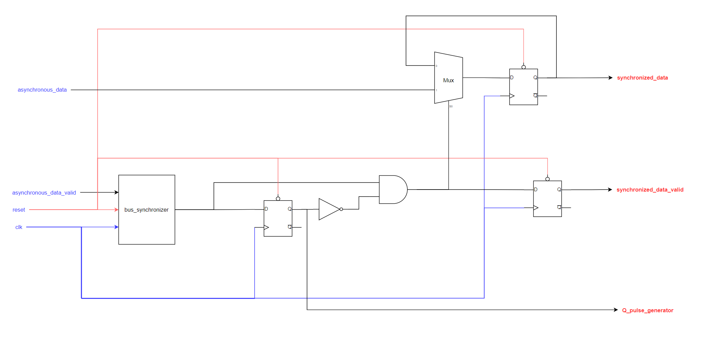

#### Port Description
<table>
    <tr>
        <th align="left">Port</th>
        <th>Direction</th>
        <th>Width</th>
        <th>Description</th>
    </tr>
    <tr>
        <td>clk</td>
        <td>input</td>
        <td align="center">1</td>
        <td>The clock of the destination domain.</td>
    </tr>
    <tr>
        <td>reset</td>
        <td>input</td>
        <td align="center">1</td>
        <td>Global active low asynchronous reset of the destination domain after synchronization.</td>
    </tr>
    <tr>
        <td>asynchronous_data_valid</td>
        <td>input</td>
        <td align="center">1</td>
        <td>A signal to indicate that the data on the 'asynchronous_data' bus is valid.</td>
    </tr>
    <tr>
        <td>asynchronous_data</td>
        <td>input</td>
        <td align="center">BUS_WIDTH (default value is 8)</td>
        <td>The data to be synchronized (it is sent from another asynchronous domain to the destination domain).</td>
    </tr>
    <tr>
        <td>Q_pulse_generator</td>
        <td>output</td>
        <td align="center">1</td>
        <td>The output of the pulse generator register.</td>
    </tr>
    <tr>
        <td>synchronous_data_valid</td>
        <td>output</td>
        <td align="center">1</td>
        <td>A signal to indicate that the synchronized data is valid.</td>
    </tr>
    <tr>
        <td>synchronous_data</td>
        <td>output</td>
        <td align="center">BUS_WIDTH (default value is 8)</td>
        <td>The data after synchronization to the destination domain.</td>
    </tr>
</table>

### System Controller

#### UART Transmitter Controller

##### Finite State Machine (FSM)

This module consists of two FSMs:
<ol>
    <li>Main FSM: It controls the state which corresponds to which frame to send by the UART transmitter (e.g. TRANSMIT_REGISTER_FILE_DATA, TRANSMIT_LOWER_ALU_RESULT, TRANSMIT_UPPER_ALU_RESULT)</li>
    <li>Transmission FSM: It is used to determine the status of the transmission (e.g. NO_TRANSMISSION, TRANSMISSION_BEGAN, TRANSMISSION_ENDED). It is used in the Main FSM to transition its state when the transmission has ended.</li>
</ol>

Main FSM: This FSM controls the following output ports according to the current state: transmitter_parallel_data_valid, transmitter_parallel_data, UART_receiver_controller_enable.

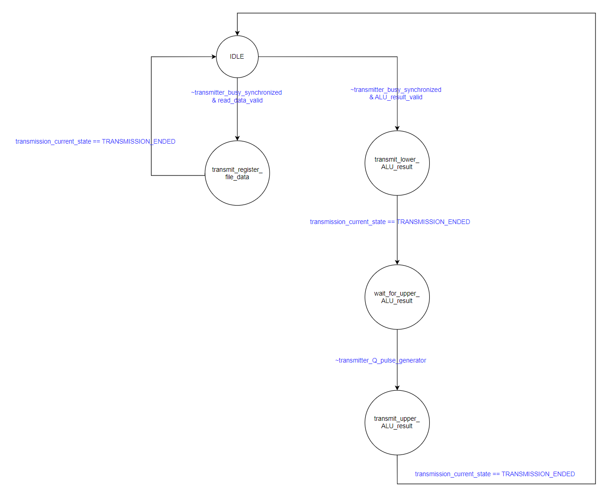

Transmission FSM:

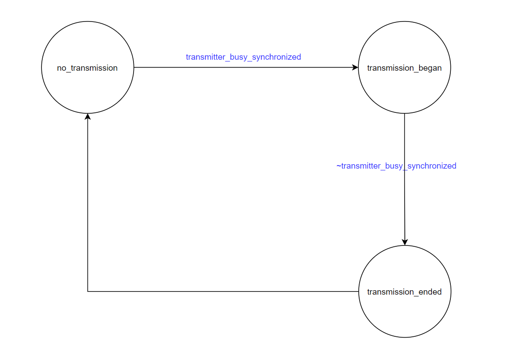

Note that if any omitted condition occurs, the current state won't change.

##### Port Description

<table>
    <tr>
        <th align="left">Port</th>
        <th>Direction</th>
        <th>Width</th>
        <th>Description</th>
    </tr>
    <tr>
        <td>clk</td>
        <td>input</td>
        <td align="center">1</td>
        <td>Reference clock.</td>
    </tr>
    <tr>
        <td>reset</td>
        <td>input</td>
        <td align="center">1</td>
        <td>Global active low asynchronous reset after synchronization.</td>
    </tr>
    <tr>
        <td>ALU_result_valid</td>
        <td>input</td>
        <td align="center">1</td>
        <td>A signal to indicate the ALU result is valid.</td>
    </tr>
    <tr>
        <td>ALU_result</td>
        <td>input</td>
        <td align="center">2 * DATA_WIDTH (defualt value is 16)</td>
        <td>The result of the ALU.</td>
    </tr>
    <tr>
        <td>read_data_valid</td>
        <td>input</td>
        <td align="center">1</td>
        <td>The data read from the given address from the register file.</td>
    </tr>
    <tr>
        <td>read_data</td>
        <td>input</td>
        <td align="center">DATA_WDITH (default value is 8)</td>
        <td>The data read from the given address from the register file.</td>
    </tr>
    <tr>
        <td>transmitter_busy_synchronized</td>
        <td>input</td>
        <td align="center">1</td>
        <td>The UART transmitter busy signal after synchronization.</td>
    </tr>
    <tr>
        <td>transmitter_Q_pulse_generator</td>
        <td>input</td>
        <td align="center">1</td>
        <td>The output signal of the pulse generator of the data synchronizer that synchronizes the UART transmitter data after being synchronized to the reference clock domain.</td>
    </tr>
    <tr>
        <td>transmitter_parallel_data_valid</td>
        <td>output</td>
        <td align="center">1</td>
        <td>A signal to indicate that there is new data to be transmitted.</td>
    </tr>
    <tr>
        <td>transmitter_parallel_data</td>
        <td>output</td>
        <td align="center">DATA_WIDTH (default value is 8)</td>
        <td>The data sent to the UART transmitter to transmit it serially.</td>
    </tr>
    <tr>
        <td>UART_receiver_controller_enable</td>
        <td>output</td>
        <td align="center">1</td>
        <td>A signal to enable the operation of the controller, this signal is used to prevent the processing of frames while there is another frame being sent by the UART transmitter.</td>
    </tr>
</table>

#### UART Receiver Controller

This module controls the ALU control signals (ALU_function, ALU_enable, ALU_clk_enable) and register file control signals (address, write_enable, write_data, read_enable) based on the received frames from the UART receiver (i.e. according to the command to be executed).

##### Finite State Machine (FSM)

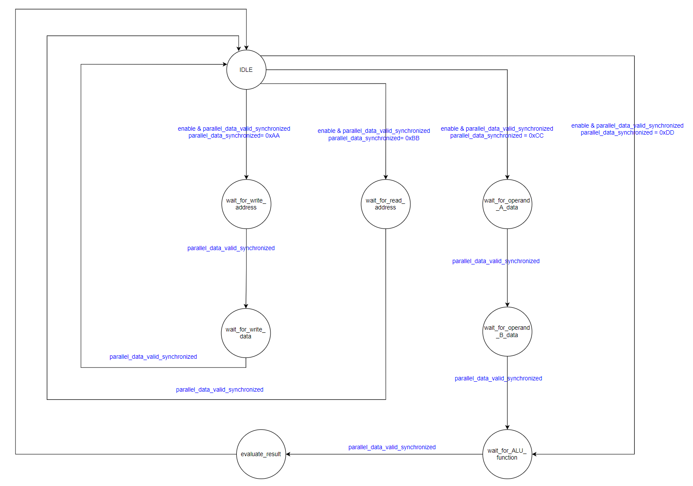

Note that if any omitted condition occurs, the current state won't change.

##### Port Description

<table>
    <tr>
        <th align="left">Port</th>
        <th>Direction</th>
        <th>Width</th>
        <th>Description</th>
    </tr>
    <tr>
        <td>clk</td>
        <td>input</td>
        <td align="center">1</td>
        <td>Reference clock.</td>
    </tr>
    <tr>
        <td>reset</td>
        <td>input</td>
        <td align="center">1</td>
        <td>Global active low asynchronous reset after synchronization.</td>
    </tr>
    <tr>
        <td>enable</td>
        <td>input</td>
        <td align="center">1</td>
        <td>A signal to enable the operation of the controller, this signal is used to prevent the processing of frames while there is another frame being sent by the UART transmitter.</td>
    </tr>
    <tr>
        <td>parallel_data_valid_synchronized</td>
        <td>input</td>
        <td align="center">1</td>
        <td>A synchrnoized signal to indicate that there exist new data received by the UART receiver.</td>
    </tr>
    <tr>
        <td>parallel_data_synchronized</td>
        <td>output</td>
        <td align="center">DATA_WIDTH (default value is 8)</td>
        <td>The data received by the UART receiver.</td>
    </tr>
    <tr>
        <td>ALU_function</td>
        <td>output</td>
        <td align="center">4</td>
        <td>A binary code to determine the function of the ALU.</td>
    </tr>
    <tr>
        <td>ALU_enable</td>
        <td>output</td>
        <td align="center">1</td>
        <td>A signal to enable the operation of the ALU.</td>
    </tr>
    <tr>
        <td>ALU_clk_enable</td>
        <td>output</td>
        <td align="center">1</td>
        <td>A signal to enable the clock gating cell which outputs the ALU clock.</td>
    </tr>
        <tr>
        <td>address</td>
        <td>output</td>
        <td align="center">log2(REGISTER_FILE_DEPTH) (defult value is 4)</td>
        <td>The address of the register to be read from or written to.</td>
    </tr>
    <tr>
        <td>write_enable</td>
        <td>output</td>
        <td align="center">1</td>
        <td>A signal to enable the read operation from the register file.</td>
    </tr>
    <tr>
        <td>write_data</td>
        <td>output</td>
        <td align="center">DATA_WIDTH (default value is 8)</td>
        <td>The data to be written in the given address in the register file.</td>
    </tr>
    <tr>
        <td>read_enable</td>
        <td>output</td>
        <td align="center">1</td>
        <td>A signal to enable the read operation in the register file.</td>
    </tr>
</table>

### Reset Synchronizer

It is used to synchronize a global reset signal to different clock domains. It consists of multiple flip-flops connected in a cascaded scheme, and the number of stages is parametrized with a default value of 2.

#### Logic Diagram

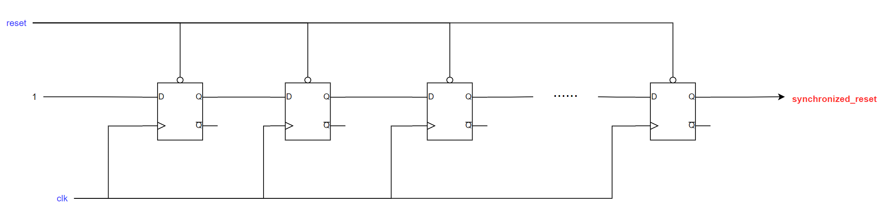

#### Port Decription
<table>
    <tr>
        <th align="left">Port</th>
        <th>Direction</th>
        <th>Width</th>
        <th>Description</th>
    </tr>
    <tr>
        <td>clk</td>
        <td>input</td>
        <td align="center">1</td>
        <td>The clock of the destination domain.</td>
    </tr>
    <tr>
        <td>reset</td>
        <td>input</td>
        <td align="center">1</td>
        <td>Unsynchronized global active low reset.</td>
    </tr>
    <tr>
        <td>reset_synchronized</td>
        <td>output</td>
        <td align="center">1</td>
        <td>The reset signal after synchronization to the destination domain.</td>
    </tr>
</table>
