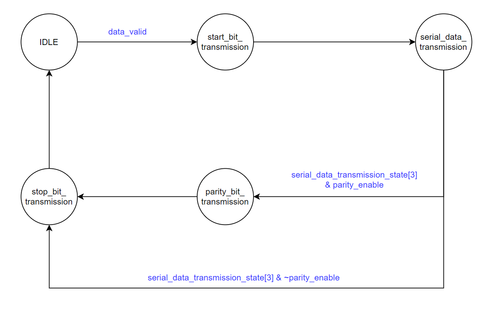
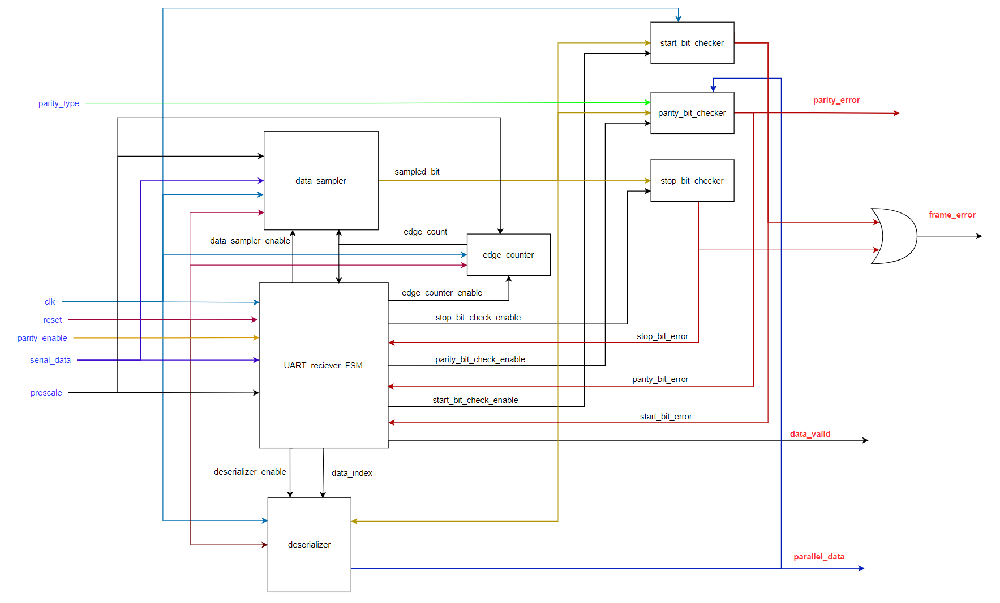
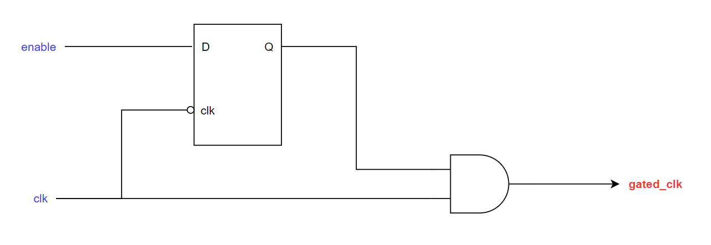
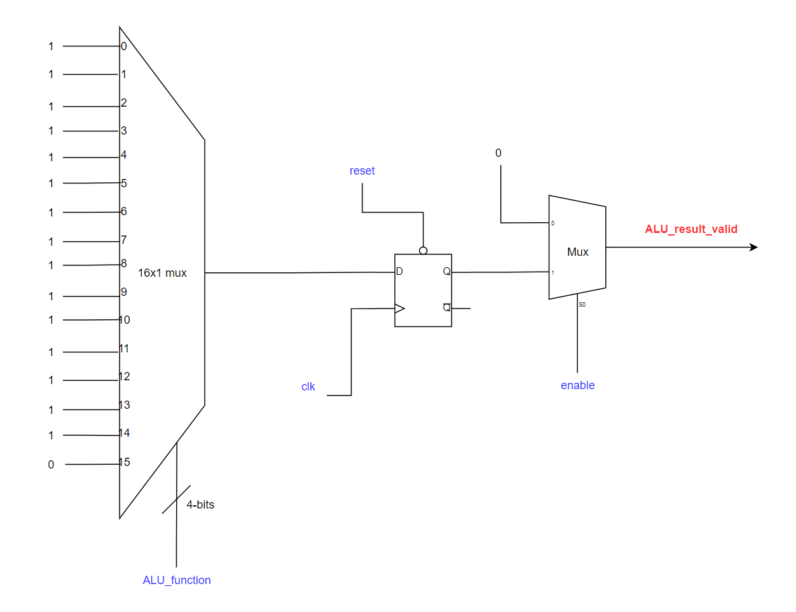

<table>
    <tr>
        <th style="text-align:left;">Port</th>
        <th>Direction</th>
        <th>Width</th>
        <th>Description</th>
    </tr>
    <tr>
        <td>FILLER</td>
        <td>FILLER</td>
        <td style="text-align:center;">FILLER</td>
        <td>FILLER</td>
    </tr>
    <tr>
        <td>FILLER</td>
        <td>FILLER</td>
        <td style="text-align:center;">FILLER</td>
        <td>FILLER</td>
    </tr>
    <tr>
        <td>FILLER</td>
        <td>FILLER</td>
        <td style="text-align:center;">FILLER</td>
        <td>FILLER</td>
    </tr>
    <tr>
        <td>FILLER</td>
        <td>FILLER</td>
        <td style="text-align:center;">FILLER</td>
        <td>FILLER</td>
    </tr>
    <tr>
        <td>FILLER</td>
        <td>FILLER</td>
        <td style="text-align:center;">FILLER</td>
        <td>FILLER</td>
    </tr>
    <tr>
        <td>FILLER</td>
        <td>FILLER</td>
        <td style="text-align:center;">FILLER</td>
        <td>FILLER</td>
    </tr>
    <tr>
        <td>FILLER</td>
        <td>FILLER</td>
        <td style="text-align:center;">FILLER</td>
        <td>FILLER</td>
    </tr>
    <tr>
        <td>FILLER</td>
        <td>FILLER</td>
        <td style="text-align:center;">FILLER</td>
        <td>FILLER</td>
    </tr>
</table>

# PrUcess (Processing unit through UART)

Pr**U**cess is a **processing** unit that executes commands (arithmetic &amp; logic operations, register file read &amp; write operations) which are received from an external source through **UART** protocol.

## System Modules

### System Top Level Module

#### Block Diagram

#### Port Description

<table>
    <tr>
        <th style="text-align:left;">Port</th>
        <th>Direction</th>
        <th>Width</th>
        <th>Description</th>
    </tr>
    <tr>
        <td>reference_clk</td>
        <td>input</td>
        <td style="text-align:center;">1</td>
        <td>The main clock of the system.</td>
    </tr>
    <tr>
        <td>UART_clk</td>
        <td>input</td>
        <td style="text-align:center;">1</td>
        <td>UART clock (the clock of the UART receiver).</td>
    </tr>
    <tr>
        <td>reset</td>
        <td>input</td>
        <td style="text-align:center;">1</td>
        <td>Unsynchronized global active low asynchronous reset.</td>
    </tr>
    <tr>
        <td>serial_data_in</td>
        <td>input</td>
        <td style="text-align:center;">1</td>
        <td>The data which is received serially by the UART receiver.</td>
    </tr>
    <tr>
        <td>serial_data_out</td>
        <td>output</td>
        <td style="text-align:center;">1</td>
        <td>The output of the UART transmitter (It is also the output of the mux that select between start, serial data, parity, or stop bits according to the state of the transmission).</td>
    </tr>
    <tr>
        <td>parity_error</td>
        <td>output</td>
        <td style="text-align:center;">1</td>
        <td>A signal to indicate that there is parity mismatch between the received parity bit and the calculated parity bit.</td>
    </tr>
    <tr>
        <td>frame_error</td>
        <td>output</td>
        <td style="text-align:center;">1</td>
        <td>A signal to indicate that the start bit or the stop bit was incorrect.</td>
    </tr>
</table>

### UART Transmitter

#### Top Level Module

#### Block Diagram

#### Port Description

<table>
    <tr>
        <th style="text-align:left;">Port</th>
        <th>Direction</th>
        <th>Width</th>
        <th>Description</th>
    </tr>
    <tr>
        <td>clk</td>
        <td>input</td>
        <td style="text-align:center;">1</td>
        <td>Generated clock produced from the clock divider whose source clock is UART clock.</td>
    </tr>
    <tr>
        <td>reset</td>
        <td>input</td>
        <td style="text-align:center;">1</td>
        <td>Global active low asynchronous reset after synchronization.</td>
    </tr>
    <tr>
        <td>parity_type</td>
        <td>input</td>
        <td style="text-align:center;">1</td>
        <td>A signal to indicate the parity type (1 for odd, 0 for even).</td>
    </tr>
    <tr>
        <td>parity_enable</td>
        <td>input</td>
        <td style="text-align:center;">1</td>
        <td>A signal to enable the transmission of the parity bit in the frame.</td>
    </tr>
    <tr>
        <td>data_valid</td>
        <td>input</td>
        <td style="text-align:center;">1</td>
        <td>A signal that indicates that there exist data to be transmitted.</td>
    </tr>
    <tr>
        <td>parallel_data</td>
        <td>input</td>
        <td style="text-align:center;">DATA_WIDTH (default value is 8)</td>
        <td>The data to be transmitted by the UART transmitter.</td>
    </tr>
    <tr>
        <td>serial_data_out</td>
        <td>output</td>
        <td style="text-align:center;">1</td>
        <td>The output of the transmitter (It is also the output of the mux that selects between start, serial data, parity, or stop bits according to the state of the transmission).</td>
    </tr>
    <tr>
        <td>busy</td>
        <td>output</td>
        <td style="text-align:center;">1</td>
        <td>A signal that indicates that the transmitter is currently in operation and it can't transmit new data.</td>
    </tr>
</table>

#### UART Transmitter Finite State Machine (FSM)

##### FSM

Note that if any omitted condition occurs, the current state won't change.

##### Port Description

<table>
    <tr>
        <th style="text-align:left;">Port</th>
        <th>Direction</th>
        <th>Width</th>
        <th>Description</th>
    </tr>
    <tr>
        <td>clk</td>
        <td>input</td>
        <td style="text-align:center;">1</td>
        <td> Generated clock produced from the clock divider whose source clock is UART clock.</td>
    </tr>
    <tr>
        <td>reset</td>
        <td>input</td>
        <td style="text-align:center;">1</td>
        <td>Global active low asynchronous reset after synchronization.</td>
    </tr>
    <tr>
        <td>parity_enable</td>
        <td>input</td>
        <td style="text-align:center;">1</td>
        <td>A signal to enable the transmission of the parity bit in the frame.</td>
    </tr>
    <tr>
        <td>data_valid</td>
        <td>input</td>
        <td style="text-align:center;">1</td>
        <td>A signal that indicates that there exist data to be transmitted.</td>
    </tr>
    <tr>
        <td>serial_enable</td>
        <td>output</td>
        <td style="text-align:center;">1</td>
        <td>A signal to enable the operation of the serializer.</td>
    </tr>
    <tr>
        <td>bit_select</td>
        <td>output</td>
        <td style="text-align:center;">2</td>
        <td>The output mux selection bits that selects the output  bit (start bit, serial data bit, parity bit, or stop bit). The value of those selection bits is decided according to the current state of the transmission.</td>
    </tr>
    <tr>
        <td>seial_data_index</td>
        <td>output</td>
        <td style="text-align:center;">log2(DATA_WIDTH) (default value is 3)</td>
        <td>A number between 0 and 7 that indicates the index of the bit to be transmitted serially.</td>
    </tr>
    <tr>
        <td>busy</td>
        <td>output</td>
        <td style="text-align:center;">1</td>
        <td>A signal that indicates that the transmitter is currently in operation and it can't transmit new data.</td>
    </tr>
</table>

#### Serializer

##### Port Description

<table>
    <tr>
        <th style="text-align:left;">Port</th>
        <th>Direction</th>
        <th>Width</th>
        <th>Description</th>
    </tr>
    <tr>
        <td>clk</td>
        <td>input</td>
        <td style="text-align:center;">1</td>
        <td> Generated clock produced from the clock divider whose source clock is UART clock.</td>
    </tr>
    <tr>
        <td>reset</td>
        <td>input</td>
        <td style="text-align:center;">1</td>
        <td>Global active low asynchronous reset after synchronization.</td>
    </tr>
    <tr>
        <td>parallel_data</td>
        <td>input</td>
        <td style="text-align:center;">DATA_WIDTH (default value is 8)</td>
        <td>The data to be transmitted by the UART transmitter.</td>
    </tr>
    <tr>
        <td>serial_enable</td>
        <td>input</td>
        <td style="text-align:center;">1</td>
        <td>A signal to enable the operation of the serializer.</td>
    </tr>    
    <tr>
        <td>serial_data_index</td>
        <td>input</td>
        <td style="text-align:center;">log2(DATA_WIDTH) (default value is 3)</td>
        <td>A number between 0 and 7 that indicates the index of the bit to be transmitted serially.</td>
    </tr>
    <tr>
        <td>serial_data</td>
        <td>output</td>
        <td style="text-align:center;">1</td>
        <td>The bit that is serially transmitted from the UART transmitter.</td>
    </tr>
</table>

#### Parity Calculator

##### Port Description

<table>
    <tr>
        <th style="text-align:left;">Port</th>
        <th>Direction</th>
        <th>Width</th>
        <th>Description</th>
    </tr>
    <tr>
        <td>clk</td>
        <td>input</td>
        <td style="text-align:center;">1</td>
        <td>Generated clock produced from the clock divider whose source clock is UART clock.</td>
    </tr>
    <tr>
        <td>reset</td>
        <td>input</td>
        <td style="text-align:center;">1</td>
        <td>Global active low asynchronous reset after synchronization.</td>
    </tr>
    <tr>
        <td>parity_type</td>
        <td>input</td>
        <td style="text-align:center;">1</td>
        <td>A signal to indicate the parity type (1 for odd, 0 for even).</td>
    </tr>
    <tr>
        <td>parity_enable</td>
        <td>input</td>
        <td style="text-align:center;">1</td>
        <td>A signal to enable the transmission of the parity bit in the frame.</td>
    </tr>
    <tr>
        <td>parallel_data</td>
        <td>input</td>
        <td style="text-align:center;">DATA_WIDTH (default value is 8)</td>
        <td>The data to be transmitted by the UART transmitter.</td>
    </tr>
    <tr>
        <td>parity_bit</td>
        <td>output</td>
        <td style="text-align:center;">1</td>
        <td>The parity bit of the parallel data to be transmitted.</td>
    </tr>
</table>

#### Output Multiplexer

##### Port Description

<table>
    <tr>
        <th style="text-align:left;">Port</th>
        <th>Direction</th>
        <th>Width</th>
        <th>Description</th>
    </tr>
    <tr>
        <td>bit_select</td>
        <td>input</td>
        <td style="text-align:center;">2</td>
        <td>The output mux selection bits that selects the output bit (start bit, serial data bit, parity bit, or stop bit).</td>
    </tr>
    <tr>
        <td>serial_data</td>
        <td>input</td>
        <td style="text-align:center;">1</td>
        <td>The bit that is serially transmitted from the UART transmitter (i.e. the output bit from the serializer).</td>
    </tr>    
    <tr>
        <td>parity_bit</td>
        <td>input</td>
        <td style="text-align:center;">1</td>
        <td>The parity bit of the parallel data to be transmitted.</td>
    </tr>
    <tr>
        <td>mux_out</td>
        <td>output</td>
        <td style="text-align:center;">1</td>
        <td>The output of the mux that selects between start, serial data, parity, or stop bits according to the state of the transmission.</td>
    </tr>
</table>

### UART Receiver

#### Top Level Module

##### Block Diagram

##### Port Description

<table>
    <tr>
        <th style="text-align:left;">Port</th>
        <th>Direction</th>
        <th>Width</th>
        <th>Description</th>
    </tr>
    <tr>
        <td>clk</td>
        <td>input</td>
        <td style="text-align:center;">1</td>
        <td>UART clock.</td>
    </tr>
    <tr>
        <td>reset</td>
        <td>input</td>
        <td style="text-align:center;">1</td>
        <td>Global active low asynchronous reset after synchronization.</td>
    </tr>
    <tr>
        <td>parity_type</td>
        <td>input</td>
        <td style="text-align:center;">1</td>
        <td>A signal to indicate the parity type (1 for odd, 0 for even).</td>
    </tr>
    <tr>
        <td>parity_enable</td>
        <td>input</td>
        <td style="text-align:center;">1</td>
        <td>A signal to enable the transmission of the parity bit in the frame.</td>
    </tr>
    <tr>
        <td>prescale</td>
        <td>input</td>
        <td style="text-align:center;">6</td>
        <td>The ratio between the frequency of the receiver and the frequecy of the transmitter (The avaialable prescale values are: 8, 16, 32).</td>
    </tr>
    <tr>
        <td>serial_data_in</td>
        <td>input</td>
        <td style="text-align:center;">1</td>
        <td>The data which is received serially.</td>
    </tr>
    <tr>
        <td>data_valid</td>
        <td>output</td>
        <td style="text-align:center;">1</td>
        <td>A signal to indicate that the received data was free of errors.</td>
    </tr>
    <tr>
        <td>parallel_data</td>
        <td>output</td>
        <td style="text-align:center;">DATA_WIDTH (default value is 8)</td>
        <td>The data which is received serially bit by bit.</td>
    </tr>
    <tr>
        <td>parity_error</td>
        <td>output</td>
        <td style="text-align:center;">1</td>
        <td>A signal to indicate that there is parity mismatch between the received parity bit and the calculated parity bit.</td>
    </tr>
    <tr>
        <td>frame_error</td>
        <td>output</td>
        <td style="text-align:center;">1</td>
        <td> A signal to indicate that the start bit or the stop bit was incorrect.</td>
    </tr>
</table>

#### UART Receiver Finite State Machine (FSM)

Note that if any omitted condition occurs, the current state won't change.

### Clock Divider

#### Port Description

<table>
    <tr>
        <th style="text-align:left;">Port</th>
        <th>Direction</th>
        <th>Width</th>
        <th>Description</th>
    </tr>
    <tr>
        <td>reference_clk</td>
        <td>input</td>
        <td style="text-align:center;">FILLER</td>
        <td>The source clock (UART clock).</td>
    </tr>
    <tr>
        <td>reset</td>
        <td>input</td>
        <td style="text-align:center;">FILLER</td>
        <td>Global active low asynchronous reset after synchronization.</td>
    </tr>
    <tr>
        <td>clk_divider_enable</td>
        <td>input</td>
        <td style="text-align:center;">FILLER</td>
        <td>An enable signal for the clock divider.</td>
    </tr>
    <tr>
        <td>division_ratio</td>
        <td>input</td>
        <td style="text-align:center;">FILLER</td>
        <td>The division ratio of the clock divider (prescale), it is connected to register_file[3].</td>
    </tr>
    <tr>
        <td>output_clk</td>
        <td>output</td>
        <td style="text-align:center;">FILLER</td>
        <td>The output divided clock (UART_transmitter_clk).</td>
    </tr>
</table>

### Register File

#### Port Decription

<table>
    <tr>
        <th style="text-align:left;">Port</th>
        <th>Direction</th>
        <th>Width</th>
        <th>Description</th>
    </tr>
    <tr>
        <td>clk</td>
        <td>input</td>
        <td style="text-align:center;">1</td>
        <td>The read and write operations are synchronized to this clock (reference clock).</td>
    </tr>
    <tr>
        <td>reset</td>
        <td>input</td>
        <td style="text-align:center;">1</td>
        <td>Global active low asynchronous reset after synchronization.</td>
    </tr>
    <tr>
        <td>address</td>
        <td>input</td>
        <td style="text-align:center;">log2(REGISTER_FILE_DEPTH) (default value is 4)</td>
        <td>The address of the register to be read from or written to.</td>
    </tr>
    <tr>
        <td>write_enable</td>
        <td>input</td>
        <td style="text-align:center;">1</td>
        <td>A signal to enable the write operation.</td>
    </tr>
    <tr>
        <td>write_data</td>
        <td>input</td>
        <td style="text-align:center;">DATA_WIDTH (default value is 8)</td>
        <td>The data to be written in the given address.</td>
    </tr>
    <tr>
        <td>read_enable</td>
        <td>input</td>
        <td style="text-align:center;">1</td>
        <td>A signal to enable the read operation.</td>
    </tr>
    <tr>
        <td>read_data_valid</td>
        <td>output</td>
        <td style="text-align:center;">1</td>
        <td>A signal to indicate that the data on the 'read_data' bus is a valid data.</td>
    </tr>
    <tr>
        <td>read_data</td>
        <td>output</td>
        <td style="text-align:center;">DATA_WIDTH (default value is 8)</td>
        <td>The data read from the given address.</td>
    </tr>
    <tr>
        <td>register0</td>
        <td>output</td>
        <td style="text-align:center;">DATA_WIDTH (default value is 8)</td>
        <td>The first register in the register file, it stores the first operand of the ALU.</td>
    </tr>
    <tr>
        <td>register1</td>
        <td>output</td>
        <td style="text-align:center;">DATA_WIDTH (default value is 8)</td>
        <td>The second register in the register file, it stores the second operand of the ALU.</td>
    </tr>
    <tr>
        <td>register2</td>
        <td>output</td>
        <td style="text-align:center;">DATA_WIDTH (default value is 8)</td>
        <td>The third register in the register file, it stores the parity configuration (parity enable and parity type) of the UART.</td>
    </tr>
    <tr>
        <td>register3</td>
        <td>output</td>
        <td style="text-align:center;">DATA_WIDTH (default value is 8)</td>
        <td>The fourth register in the register file, it stores the value of the prescale used in the clock divider (it is the ratio between the clock frequency of the UART receiver and the clock frequency of the UART transmitter).</td>
    </tr>
</table>

### Clock Gating Cell

#### Logic Diagram

#### Port Description

<table>
    <tr>
        <th style="text-align:left;">Port</th>
        <th>Direction</th>
        <th>Width</th>
        <th>Description</th>
    </tr>
    <tr>
        <td>clk</td>
        <td>input</td>
        <td style="text-align:center;">1</td>
        <td>The source clock to be gated (reference clock).</td>
    </tr>
    <tr>
        <td>clk_enable</td>
        <td>input</td>
        <td style="text-align:center;">1</td>
        <td>An enable signal for the clock gating.</td>
    </tr>
    <tr>
        <td>gated_clk</td>
        <td>output</td>
        <td style="text-align:center;">1</td>
        <td>The output gated clock (ALU clock).</td>
    </tr>
</table>

### ALU

#### Logic Diagram

'ALU result' logic diagram:

'ALU result valid' logic diagram:

#### Port Decription

<table>
    <tr>
        <th style="text-align:left;">Port</th>
        <th>Direction</th>
        <th>Width</th>
        <th>Description</th>
    </tr>
    <tr>
        <td>clk</td>
        <td>input</td>
        <td style="text-align:center;">1</td>
        <td>The ALU result is synchronized to this clock (reference clock).</td>
    </tr>
    <tr>
        <td>reset</td>
        <td>input</td>
        <td style="text-align:center;">1</td>
        <td>Global active low asynchronous reset after synchronization.</td>
    </tr>
    <tr>
        <td>A</td>
        <td>input</td>
        <td style="text-align:center;">DATA_WIDTH (default value is 8)</td>
        <td>ALU's first operand (it is connected to register_file[0]).</td>
    </tr>
    <tr>
        <td>B</td>
        <td>input</td>
        <td style="text-align:center;">DATA_WIDTH (default value is 8)</td>
        <td>ALU's second operand (it is connected to register_file[1]).</td>
    </tr>
    <tr>
        <td>ALU_function</td>
        <td>input</td>
        <td style="text-align:center;">4</td>
        <td>A binary code to determine the function of the ALU.</td>
    </tr>
    <tr>
        <td>enable</td>
        <td>input</td>
        <td style="text-align:center;">1</td>
        <td>ALU enable signal.</td>
    </tr>
    <tr>
        <td>ALU_result_valid</td>
        <td>output</td>
        <td style="text-align:center;">1</td>
        <td>A signal to indicate the ALU result is valid.</td>
    </tr>
    <tr>
        <td>ALU_result</td>
        <td>output</td>
        <td style="text-align:center;">2 * DATA_WIDTH (default value is 16)</td>
        <td>The result of the ALU.</td>
    </tr>
</table>