# PrUcess (Processing unit through UART)

## Introduction

Pr**U**cess is a **processing** unit that executes commands (arithmetic &amp; logical operations, register file read &amp; write operations) which are received from an external source through **UART** receiver module and it transmits the commands' results through the **UART** transmitter module.

This is a full ASIC design project (from RTL to GDS). It goes through the ASIC design flow from frontend to backend:
<ol>
    <li>System's architecture design.</li>
    <li>Synthesizable Verilog RTL modelling (behavioral modelling, structural modelling, and FSM coding) of all the system blocks from scratch (UART transmitter and receiver, integer clock divider, ALU, register file, parametrized data and bit synchronizers for solving CDC issues, reset synchronizer, and system's main controller).</li>
    <li>Functional verification using self-checking testbenches and automated Python verification environments and running the testbenches using Modelsim.</li>
    <li>Logic synthesis using Synopsys Design Compiler.</li>
    <li>Formal verification post logic synthesis using Synopsys Formality.</li>
    <li>Design for testability (DFT) using Synopsys DFT Compiler.</li>
    <li>Formal verification post DFT using Synopsys Formality.</li>
    <li>Physical design (floor planning, power planning, placement, CTS, routing, timing closure, and chip finishing) using Cadence innovus.</li>
    <li>Formal verification post physical design using Synopsys Formality.</li>
</ol>

## Table of Contents
1. [System's Specifications](#systems-specifications)
2. [System Top Level Module](#system-top-level-module)
3. [System Functional Verification](#functional-verification)
4. [UART Transmitter](#uart-transmitter)
5. [UART Receiver](#uart-receiver)
6. [Clock Divider](#clock-divider)
7. [Clock Gating Cell](#clock-gating-cell)
8. [ALU](#alu)
9. [Register File](#register-file)
10. [Bus Synchronizer](#bus-synchronizer)
11. [Data Synchronizer](#data-synchronizer)
12. [System Controller](#system-controller)
13. [UART Transmitter Controller](#uart-transmitter-controller)
14. [UART Receiver Controller](#uart-receiver-controller)
15. [Reset Synchronizer](#reset-synchronizer)
16. [Logic Synthesis](#logic-synthesis)
17. [Post - Logic Synthesis Formal Verification](#post---logic-synthesis-formal-verification)
18. [Design For Testability (DFT)](#design-for-testability-dft)
19. [Post - DFT Formal Verification](#post---dft-formal-verification)
20. [Physical Design](#physical-design)
21. [Final Chip Layout](#chip-finishing)
22. [Post - Physical Design Formal Verification](#post---physical-design-formal-verification)

## System's Specifications

UART is a standard serial communication protocol widely used in many applications. Oversampling is a technique used in UART receivers to improve the accuracy and reliability of the received data. In a UART receiver, data is received as a series of binary bits that are transmitted asynchronously with respect to a clock signal. To correctly interpret the received data, the receiver must sample the incoming signal at the correct time to capture the correct value of each bit. Oversampling involves sampling the incoming signal at a higher frequency than the baud rate of the transmitted data. This means that multiple samples are taken during the transmission of each bit, allowing the receiver to more accurately determine the timing and value of each bit. Oversampling also helps to mitigate the effects of noise and other signal distortions that can cause errors in the received data. By taking multiple samples of each bit, the receiver can detect and correct for these errors, improving the overall reliability of the data transmission.

The system includes two asynchronous clock domains (reference clock domain and UART clock domain). The command is received by the UART receiver, then it is sent to the system controller through a synchronizer (to solve the CDC issues) to decode and execute the command and then it sends the result to the UART transmitter through a synchronizer which will finally transmit it serially.

#### System's Parameters

<table>
    <tr>
        <th align="left">Parameter</th>
        <th>Default Value</th>
        <th>Description</th>
    </tr>
    <tr>
        <td>DATA_WIDTH</td>
        <td align="center">8</td>
        <td>It is the size of: registers, ALU operands, UART transmitter frames, and UART receiver frames.</td>
    </tr>
    <tr>
        <td>REGISTER_FILE_DEPTH</td>
        <td align="center">16</td>
        <td>The number of registers in the register file.</td>
    </tr>
    <tr>
        <td>SYNCHRONIZER_STAGE_COUNT</td>
        <td align="center">2</td>
        <td>The number of stages in a synchronizer.</td>
    </tr>
    <tr>
        <td>oversampling_prescale</td>
        <td align="center">the default value after resetting the system is 8</td>
        <td>The ratio between the frequency of the UART receiver clock and the frequency of the UART transmitter clock.</td>
    </tr>
</table>

#### System's Clock Domains

<table>
    <tr>
        <th align="left">Clock Domain</th>
        <th>Clock Names</th>
        <th>Modules</th>
        <th>Frequency</th>
    </tr>
    <tr>
        <td>Reference clock domain</td>
        <td>
            <ul>
                <li>reference_clk</li>
                <li>ALU_clk</li>
            </ul>
        </td>
        <td>
            <ul>
                <li>System controller</li>
                <li>ALU</li>
                <li>Register file</li>
            </ul>
        </td>
        <td align="center">Reference clock frequency = ALU clock frequency = 40 MHz</td>
    </tr>
    <tr>
        <td>UART clock domain</td>
        <td>
            <ul>
                <li>UART_clk</li>
                <li>UART_transmitter_clk</li>
            </ul>
        </td>
        <td>
            <ul>
                <li>UART transmitter</li>
                <li>UART receiver</li>
                <li>Clock divider</li>
            </ul>
        </td>
        <td align="center">
            <ul>
                <li>UART transmitter clock frequency = 115.2 KHz (standard baud rate)</li>
                <li>UART clock frequency = oversampling_prescale * 115.2 KHz = 32 * 115.2 KHz = 3.6864 MHz</li>
            </ul>
        </td>
    </tr>
</table>

Note that the oversampling prescale can have the values (8, 16, or 32) but 32 is used in the simulations and backend flow to ensure that the UART receiver is functioning correctly in the worst case (highest clock frequency).

#### System's Components:
<ol>
    <li>UART: It consists of UART receiver which receives the commands and UART transmitter that transmits the commands' results.</li>
    <li>Clock divider: An integer clock divider which can divide the source clock up to division ratio of 32. It is used to divide the UART clock to produce UART transmitter clock with division ratio equal oversampling prescale.</li>
    <li>ALU: It executes arithmetic and logical operations.</li>
    <li>Clock gating cell: It is used to gate the ALU clock because there is significant time in which the ALU is not in operation (because the ALU operates on a very fast clock compared with the UART, so it waits long time to receive a new command).</li>
    <li>Register file.</li>
    <li>System controller: It is the main controller of the system. It consists of UART transmitter controller and UART receiver controller. The UART transmitter controller controls the UART transmitter by sending to it the data to be sent serially after it is ready (ALU result or register file data). The UART receiver controller controls the ALU and register file control signals based on the received frames from the UART receiver.</li>
    <li>Reset synchronizer: It is used to synchronize the global reset to all clock domains.</li>
    <li>Bus synchronizer: This module can be used to synchronize a single bit or a grey encoded bus between two asynchronous clock domains. It is a generic module (setting BUS_WIDTH = 1, means that it is a single bit synchronizer).</li>
    <li>Data synchronizer: It is used to synchronize a bus by using a bit synchronizer and pulse generator to synchronize the bus's data valid signal.</li>
</ol>

#### ALU Operations:
<ol>
    <li>Addition (+)</li>
    <li>Subtraction (-)</li>
    <li>Multiplication (*)</li>
    <li>Division (/)</li>
    <li>Bit-wise AND (&)</li>
    <li>Bit-wise OR (|)</li>
    <li>Bit-wise NAND (~&)</li>
    <li>Bit-wise NOR (~|)</li>
    <li>Bit-wise XOR (^)</li>
    <li>Bit-wise XNOR (~^)</li>
    <li>Is equal (==)</li>
    <li>Is greater than (>)</li>
    <li>Is less than (<)</li>
    <li>Shift right (>>1)</li>
    <li>Shift left (<<1)</li>
</ol>

#### System's Commands:
<ul>
    <li>Register file write command. This command consists of 3 frames as follows: 
        <ol>
            <li>Command opcode (0xAA)</li>
            <li>Register file write address</li>
            <li>Register file write data</li>
        </ol>
    </li>
    <li>Register file read command. This command consists of 2 frames as follows: 
        <ol>
            <li>Command opcode (0xBB)</li>
            <li>Register file read address</li>
        </ol>
    </li>
    <li>ALU operation with operands command. The operands of the ALU are connected to the first two registers of the register file, so to execute this command: the operands are first written to the first two registers in the register file then the result is evaluated. This command consists of 4 frames as follows: 
        <ol>
            <li>Command opcode (0xCC)</li>
            <li>Operand A</li>
            <li>Operand B</li>
            <li>ALU function</li>
        </ol>
    </li>
    <li>ALU operation without operands command. This command executes the ALU operation on the stored values in the first two registers in the register file directly. This command consists of 2 frames as follows: 
        <ol>
            <li>Command opcode (0xDD)</li>
            <li>ALU function</li>
        </ol>
    </li>
</ul>

In all ALU commands, the UART transmitter sends two consecutive frames (becuase the size of the ALU result is double the size of the frame).

#### System's Configurations
<ul>
    <li>The parity configuration of UART (parity enable and parity type).</li>
    <li>The oversampling prescale (division ratio) of the UART receiver.</li>
</ul>

Note that the mentioned configurations are outputs from the register file (reference clock domain) and they are inputs to blocks that operates on UART clock (i.e. Metastability may occur becuase the source and destination domains are asynchronous to one another), however there is no synchronizers used to synchronize those signals because they are **Quasi-static signals** (they are effectively stable for long periods of time. Such domain crossings do not require synchronizers in the destination domain, because they are held long enough to be captured by even the slowest clock domains without the risk of metastability).

## System Top Level Module

### Block Diagram

#### Port Description

<table>
    <tr>
        <th align="left">Port</th>
        <th>Direction</th>
        <th>Width</th>
        <th>Description</th>
    </tr>
    <tr>
        <td>reference_clk</td>
        <td>input</td>
        <td align="center">1</td>
        <td>The main clock of the system.</td>
    </tr>
    <tr>
        <td>UART_clk</td>
        <td>input</td>
        <td align="center">1</td>
        <td>UART clock (the clock of the UART receiver).</td>
    </tr>
    <tr>
        <td>reset</td>
        <td>input</td>
        <td align="center">1</td>
        <td>Unsynchronized global active low asynchronous reset.</td>
    </tr>
    <tr>
        <td>serial_data_in</td>
        <td>input</td>
        <td align="center">1</td>
        <td>The data which is received serially by the UART receiver.</td>
    </tr>
    <tr>
        <td>serial_data_out</td>
        <td>output</td>
        <td align="center">1</td>
        <td>The output of the UART transmitter (It is also the output of the mux that select between start, serial data, parity, or stop bits according to the state of the transmission).</td>
    </tr>
    <tr>
        <td>parity_error</td>
        <td>output</td>
        <td align="center">1</td>
        <td>A signal to indicate that there is parity mismatch between the received parity bit and the calculated parity bit.</td>
    </tr>
    <tr>
        <td>frame_error</td>
        <td>output</td>
        <td align="center">1</td>
        <td>A signal to indicate that the start bit or the stop bit was incorrect.</td>
    </tr>
</table>

### Functional Verification

The whole system is verified through an automated Python environment which does the following:
<ol>
    <li>Generates the opcodes of all the given commands in an external file.</li>
    <li>Generates all the expected results that should be transmitted serially through the UART transmitter in an external file.</li>
    <li>Generates the memory file which corresponds to the final values that should be stored in the register file after the execution of all the commands.</li>
    <li>Compares the results of the Verilog testbench (transmitted through UART transmitter) and the generated memory file with the expected results' file and expected memory file.</li>
    <li>Reports any mismatch that occur in the testbench.</li>
    <li>Reports the number of passed and failed testcases.</li>
</ol>

Sample test cases:
Any arbitrary test case can be written in `functional_verification/system_top/test_cases_generator.py` as the following:

Then the script `functional_verification/system_top/run.tcl` is used to: run the Python script to generate the expected results, run the testbench to generate the actual results, and compare both the results to report any mismatch in the results.

## System Submodules

### UART Transmitter

#### UART Transmitter Frame Types

#### Top Level Module

#### Block Diagram

#### Port Description

<table>
    <tr>
        <th align="left">Port</th>
        <th>Direction</th>
        <th>Width</th>
        <th>Description</th>
    </tr>
    <tr>
        <td>clk</td>
        <td>input</td>
        <td align="center">1</td>
        <td>Generated clock produced from the clock divider whose source clock is UART clock.</td>
    </tr>
    <tr>
        <td>reset</td>
        <td>input</td>
        <td align="center">1</td>
        <td>Global active low asynchronous reset after synchronization.</td>
    </tr>
    <tr>
        <td>parity_type</td>
        <td>input</td>
        <td align="center">1</td>
        <td>A signal to indicate the parity type (1 for odd, 0 for even).</td>
    </tr>
    <tr>
        <td>parity_enable</td>
        <td>input</td>
        <td align="center">1</td>
        <td>A signal to enable the transmission of the parity bit in the frame.</td>
    </tr>
    <tr>
        <td>data_valid</td>
        <td>input</td>
        <td align="center">1</td>
        <td>A signal that indicates that there exist data to be transmitted.</td>
    </tr>
    <tr>
        <td>parallel_data</td>
        <td>input</td>
        <td align="center">DATA_WIDTH (default value is 8)</td>
        <td>The data to be transmitted by the UART transmitter.</td>
    </tr>
    <tr>
        <td>serial_data_out</td>
        <td>output</td>
        <td align="center">1</td>
        <td>The output of the transmitter (It is also the output of the mux that selects between start, serial data, parity, or stop bits according to the state of the transmission).</td>
    </tr>
    <tr>
        <td>busy</td>
        <td>output</td>
        <td align="center">1</td>
        <td>A signal that indicates that the transmitter is currently in operation and it can't transmit new data.</td>
    </tr>
</table>

#### UART Transmitter Finite State Machine (FSM)

##### FSM

Note that if any omitted condition occurs, the current state won't change.

This FSM controls the following output ports according to the current state: busy, serial_enable, bit_select.

##### Port Description

<table>
    <tr>
        <th align="left">Port</th>
        <th>Direction</th>
        <th>Width</th>
        <th>Description</th>
    </tr>
    <tr>
        <td>clk</td>
        <td>input</td>
        <td align="center">1</td>
        <td> Generated clock produced from the clock divider whose source clock is UART clock.</td>
    </tr>
    <tr>
        <td>reset</td>
        <td>input</td>
        <td align="center">1</td>
        <td>Global active low asynchronous reset after synchronization.</td>
    </tr>
    <tr>
        <td>parity_enable</td>
        <td>input</td>
        <td align="center">1</td>
        <td>A signal to enable the transmission of the parity bit in the frame.</td>
    </tr>
    <tr>
        <td>data_valid</td>
        <td>input</td>
        <td align="center">1</td>
        <td>A signal that indicates that there exist data to be transmitted.</td>
    </tr>
    <tr>
        <td>serial_enable</td>
        <td>output</td>
        <td align="center">1</td>
        <td>A signal to enable the operation of the serializer.</td>
    </tr>
    <tr>
        <td>bit_select</td>
        <td>output</td>
        <td align="center">2</td>
        <td>The output mux selection bits that selects the output  bit (start bit, serial data bit, parity bit, or stop bit). The value of those selection bits is decided according to the current state of the transmission.</td>
    </tr>
    <tr>
        <td>seial_data_index</td>
        <td>output</td>
        <td align="center">log2(DATA_WIDTH) (default value is 3)</td>
        <td>A number between 0 and 7 that indicates the index of the bit to be transmitted serially.</td>
    </tr>
    <tr>
        <td>busy</td>
        <td>output</td>
        <td align="center">1</td>
        <td>A signal that indicates that the transmitter is currently in operation and it can't transmit new data.</td>
    </tr>
</table>

#### Serializer

It produces serial bits from the parallel data (from LSB to MSB) according to the input index.

##### Port Description
<table>
    <tr>
        <th align="left">Port</th>
        <th>Direction</th>
        <th>Width</th>
        <th>Description</th>
    </tr>
    <tr>
        <td>clk</td>
        <td>input</td>
        <td align="center">1</td>
        <td> Generated clock produced from the clock divider whose source clock is UART clock.</td>
    </tr>
    <tr>
        <td>reset</td>
        <td>input</td>
        <td align="center">1</td>
        <td>Global active low asynchronous reset after synchronization.</td>
    </tr>
    <tr>
        <td>parallel_data</td>
        <td>input</td>
        <td align="center">DATA_WIDTH (default value is 8)</td>
        <td>The data to be transmitted by the UART transmitter.</td>
    </tr>
    <tr>
        <td>serial_enable</td>
        <td>input</td>
        <td align="center">1</td>
        <td>A signal to enable the operation of the serializer.</td>
    </tr>  
    <tr>
        <td>serial_data_index</td>
        <td>input</td>
        <td align="center">log2(DATA_WIDTH) (default value is 3)</td>
        <td>A number between 0 and 7 that indicates the index of the bit to be transmitted serially.</td>
    </tr>
    <tr>
        <td>serial_data</td>
        <td>output</td>
        <td align="center">1</td>
        <td>The bit that is serially transmitted from the UART transmitter.</td>
    </tr>
</table>

#### Parity Calculator

It calculates the parity bit according to the parity type.

##### Port Description
<table>
    <tr>
        <th align="left">Port</th>
        <th>Direction</th>
        <th>Width</th>
        <th>Description</th>
    </tr>
    <tr>
        <td>clk</td>
        <td>input</td>
        <td align="center">1</td>
        <td>Generated clock produced from the clock divider whose source clock is UART clock.</td>
    </tr>
    <tr>
        <td>reset</td>
        <td>input</td>
        <td align="center">1</td>
        <td>Global active low asynchronous reset after synchronization.</td>
    </tr>
    <tr>
        <td>parity_type</td>
        <td>input</td>
        <td align="center">1</td>
        <td>A signal to indicate the parity type (1 for odd, 0 for even).</td>
    </tr>
    <tr>
        <td>parity_enable</td>
        <td>input</td>
        <td align="center">1</td>
        <td>A signal to enable the transmission of the parity bit in the frame.</td>
    </tr>
    <tr>
        <td>parallel_data</td>
        <td>input</td>
        <td align="center">DATA_WIDTH (default value is 8)</td>
        <td>The data to be transmitted by the UART transmitter.</td>
    </tr>
    <tr>
        <td>parity_bit</td>
        <td>output</td>
        <td align="center">1</td>
        <td>The parity bit of the parallel data to be transmitted.</td>
    </tr>
</table>

#### Output Multiplexer

It selects between (start bit, serial data bit, parity bit, or stop bit) according to the current state of trasnmission.

##### Port Description

<table>
    <tr>
        <th align="left">Port</th>
        <th>Direction</th>
        <th>Width</th>
        <th>Description</th>
    </tr>
    <tr>
        <td>bit_select</td>
        <td>input</td>
        <td align="center">2</td>
        <td>The output mux selection bits that selects the output bit (start bit, serial data bit, parity bit, or stop bit).</td>
    </tr>
    <tr>
        <td>serial_data</td>
        <td>input</td>
        <td align="center">1</td>
        <td>The bit that is serially transmitted from the UART transmitter (i.e. the output bit from the serializer).</td>
    </tr>  
    <tr>
        <td>parity_bit</td>
        <td>input</td>
        <td align="center">1</td>
        <td>The parity bit of the parallel data to be transmitted.</td>
    </tr>
    <tr>
        <td>mux_out</td>
        <td>output</td>
        <td align="center">1</td>
        <td>The output of the mux that selects between start, serial data, parity, or stop bits according to the state of the transmission.</td>
    </tr>
</table>

#### Functional Verification

This module is verified through self-checking testbench in Modelsim. The testbench can be run using `run.tcl` script.

### UART Receiver

The following figure illustrates how oversampling with prescale = 8 works, the recieved bit is sampled 3 times and output bit from the sampler is the most represented bit in those 3 bits.

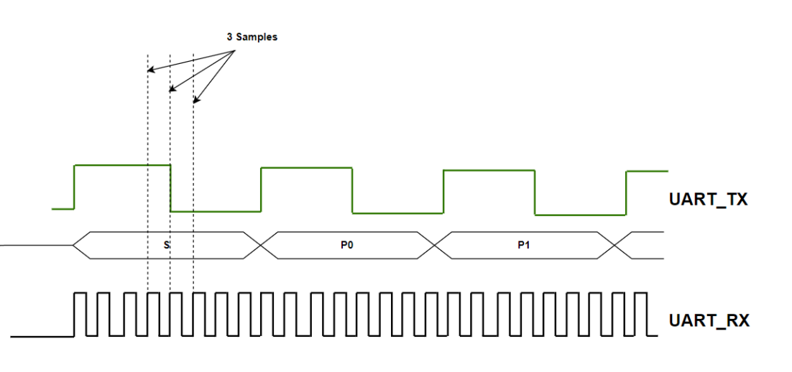

#### Top Level Module

##### Block Diagram

##### Port Description

<table>
    <tr>
        <th align="left">Port</th>
        <th>Direction</th>
        <th>Width</th>
        <th>Description</th>
    </tr>
    <tr>
        <td>clk</td>
        <td>input</td>
        <td align="center">1</td>
        <td>UART clock.</td>
    </tr>
    <tr>
        <td>reset</td>
        <td>input</td>
        <td align="center">1</td>
        <td>Global active low asynchronous reset after synchronization.</td>
    </tr>
    <tr>
        <td>parity_type</td>
        <td>input</td>
        <td align="center">1</td>
        <td>A signal to indicate the parity type (1 for odd, 0 for even).</td>
    </tr>
    <tr>
        <td>parity_enable</td>
        <td>input</td>
        <td align="center">1</td>
        <td>A signal to enable the transmission of the parity bit in the frame.</td>
    </tr>
    <tr>
        <td>prescale</td>
        <td>input</td>
        <td align="center">6</td>
        <td>The ratio between the frequency of the receiver and the frequecy of the transmitter (The avaialable oversampling_prescale values are: 8, 16, 32).</td>
    </tr>
    <tr>
        <td>serial_data_in</td>
        <td>input</td>
        <td align="center">1</td>
        <td>The data which is received serially.</td>
    </tr>
    <tr>
        <td>data_valid</td>
        <td>output</td>
        <td align="center">1</td>
        <td>A signal to indicate that the received data was free of errors.</td>
    </tr>
    <tr>
        <td>parallel_data</td>
        <td>output</td>
        <td align="center">DATA_WIDTH (default value is 8)</td>
        <td>The data which is received serially bit by bit.</td>
    </tr>
    <tr>
        <td>parity_error</td>
        <td>output</td>
        <td align="center">1</td>
        <td>A signal to indicate that there is parity mismatch between the received parity bit and the calculated parity bit.</td>
    </tr>
    <tr>
        <td>frame_error</td>
        <td>output</td>
        <td align="center">1</td>
        <td> A signal to indicate that the start bit or the stop bit was incorrect.</td>
    </tr>
</table>

#### UART Receiver Finite State Machine (FSM)

Note that if any omitted condition occurs, the current state won't change.

<table>
    <tr>
        <th align="left">Port</th>
        <th>Direction</th>
        <th>Width</th>
        <th>Description</th>
    </tr>
    <tr>
        <td>clk</td>
        <td>input</td>
        <td align="center">1</td>
        <td>UART clock.</td>
    </tr>
    <tr>
        <td>reset</td>
        <td>input</td>
        <td align="center">1</td>
        <td>Global active low asynchronous reset after synchronization.</td>
    </tr>
    <tr>
        <td>parity_enable</td>
        <td>input</td>
        <td align="center">1</td>
        <td>A signal to enable the transmission of the parity bit in the frame.</td>
    </tr>
    <tr>
        <td>prescale</td>
        <td>input</td>
        <td align="center">6</td>
        <td>The ratio between the frequency of the receiver and the frequecy of the transmitter (The avaialable prescale values are: 8, 16, 32).</td>
    </tr>
    <tr>
        <td>serial_data_in</td>
        <td>input</td>
        <td align="center">5</td>
        <td>The data which is received serially.</td>
    </tr>
    <tr>
        <td>start_bit_error</td>
        <td>input</td>
        <td align="center">1</td>
        <td>A signal to indicate that the sampled start bit is wrong (i.e. the samples are 011 or 111 or 110 or 101).</td>
    </tr>
    <tr>
        <td>parity_bit_error</td>
        <td>input</td>
        <td align="center">1</td>
        <td>A signal to indicate that the sampled parity bit is wrong.</td>
    </tr>
    <tr>
        <td>stop_bit_error</td>
        <td>input</td>
        <td align="center">1</td>
        <td>A signal to indicate that the sampled stop bit is wrong (i.e. the samples are 100 or 000 or 001 or 010).</td>
    </tr>
    <tr>
        <td>edge_count</td>
        <td>input</td>
        <td align="center">5</td>
        <td>A counter value which indicates the number of the current edge. Its value depends on the prescale value (because prescale of value 8 means that the counter should stop at 7 and wrap around again).</td>
    </tr>
    <tr>
        <td>edge_count_done</td>
        <td>input</td>
        <td align="center">1</td>
        <td>A signal to indicate that a full cycle of the UART tranmsitter has passed (when prescale value is 8, edge_count_done becomes high when the edge counter value is 7).</td>
    </tr>
    <tr>
        <td>start_bit_check_enable</td>
        <td>output</td>
        <td align="center">1</td>
        <td>A signal to enable the operation of the start bit checker.</td>
    </tr>
    <tr>
        <td>parity_bit_check_enable</td>
        <td>output</td>
        <td align="center">1</td>
        <td>A signal to enable the operation of the parity bit checker.</td>
    </tr>
    <tr>
        <td>stop_bit_check_enable</td>
        <td>output</td>
        <td align="center">1</td>
        <td>A signal to enable the operation of the stop bit checker.</td>
    </tr>
    <tr>
        <td>edge_counter_and_data_sampler_enable</td>
        <td>output</td>
        <td align="center">1</td>
        <td>A signal to enable the operation of the edge counter and data sampler.</td>
    </tr>
    <tr>
        <td>deserializer_enable</td>
        <td>output</td>
        <td align="center">1</td>
        <td>A signal to enable the operation of the deserializer.</td>
    </tr>
    <tr>
        <td>data_index</td>
        <td>output</td>
        <td align="center">log2(DATA_WIDTH) (default value is 3)</td>
        <td>The index of the of bit to be received in the frame.</td>
    </tr>
    <tr>
        <td>data_valid</td>
        <td>output</td>
        <td align="center">1</td>
        <td>A signal to indicate that the received data by the UART receiver was free of errors.</td>
    </tr>
</table>

#### Edge Counter
<table>
    <tr>
        <th align="left">Port</th>
        <th>Direction</th>
        <th>Width</th>
        <th>Description</th>
    </tr>
    <tr>
        <td>clk</td>
        <td>input</td>
        <td align="center">1</td>
        <td>UART clock.</td>
    </tr>
    <tr>
        <td>reset</td>
        <td>input</td>
        <td align="center">1</td>
        <td>Global active low asynchronous reset after synchronization.</td>
    </tr>
    <tr>
        <td>prescale</td>
        <td>input</td>
        <td align="center">6</td>
        <td>The ratio between the frequency of the receiver and the frequecy of the transmitter (The avaialable prescale values are: 8, 16, 32).</td>
    </tr>
    <tr>
        <td>enable</td>
        <td>input</td>
        <td align="center">1</td>
        <td>A signal to enable the operation of the edge counter.</td>
    </tr>
    <tr>
        <td>edge_count</td>
        <td>output</td>
        <td align="center">5</td>
        <td>A counter value which indicates the number of the current edge. Its value depends on the prescale value (because prescale of value 8 means that the counter should stop at 7 and wrap around again).</td>
    </tr>
    <tr>
        <td>edge_count_done</td>
        <td>output</td>
        <td align="center">1</td>
        <td>A signal to indicate that a full cycle of the UART tranmsitter has passed (when prescale value is 8, edge_count_done becomes high when the edge counter value is 7).</td>
    </tr>
</table>

#### Data Sampler
<table>
    <tr>
        <th align="left">Port</th>
        <th>Direction</th>
        <th>Width</th>
        <th>Description</th>
    </tr>
    <tr>
        <td>clk</td>
        <td>input</td>
        <td align="center">1</td>
        <td>UART clock.</td>
    </tr>
    <tr>
        <td>reset</td>
        <td>input</td>
        <td align="center">1</td>
        <td>Global active low asynchronous reset after synchronization.</td>
    </tr>
    <tr>
        <td>serial_data_in</td>
        <td>input</td>
        <td align="center">1</td>
        <td>The data which is received serially.</td>
    </tr>
    <tr>
        <td>prescale</td>
        <td>input</td>
        <td align="center">5</td>
        <td>The ratio between the frequency of the receiver and the frequecy of the transmitter (The avaialable prescale values are: 8, 16, 32). These are the 5 MSBs of the prescale, becuase the data sampler module operates on the prescale after shifting its value.</td>
    </tr>
    <tr>
        <td>enable</td>
        <td>input</td>
        <td align="center">1</td>
        <td>A signal to enable the data sampler.</td>
    </tr>
    <tr>
        <td>edge_count</td>
        <td>output</td>
        <td align="center">5</td>
        <td>A counter value which indicates the number of the current edge. Its value depends on the prescale value (because prescale of value 8 means that the counter should stop at 7 and wrap around again).</td>
    </tr>
    <tr>
        <td>sampled_bit</td>
        <td>output</td>
        <td align="center">1</td>
        <td>The resulting sampled bit out of three samples taken at three different edges. It is equal to the bit appearing the most times in the samples (e.g. if samples = 101, sampled_bit = 1. if samples = 100, sampled_bit = 0).</td>
    </tr>
</table>

#### Deserializer
<table>
    <tr>
        <th align="left">Port</th>
        <th>Direction</th>
        <th>Width</th>
        <th>Description</th>
    </tr>
    <tr>
        <td>clk</td>
        <td>input</td>
        <td align="center">1</td>
        <td>UART clock.</td>
    </tr>
    <tr>
        <td>reset</td>
        <td>input</td>
        <td align="center">1</td>
        <td>Global active low asynchronous reset after synchronization.</td>
    </tr>
    <tr>
        <td>enable</td>
        <td>input</td>
        <td align="center">1</td>
        <td>A signal to enable the operation of the deserializer.</td>
    </tr>
    <tr>
        <td>data_index</td>
        <td>input</td>
        <td align="center">log2(DATA_WIDTH) (default value is 3)</td>
        <td>The index of the of bit to be received in the frame.</td>
    </tr>
    <tr>
        <td>sampled_bit</td>
        <td>input</td>
        <td align="center">1</td>
        <td>The resulting sampled bit out of three samples taken at three different edges. It is equal to the bit appearing the most times in the samples (e.g. if samples = 101, sampled_bit = 1. if samples = 100, sampled_bit = 0).</td>
    </tr>
    <tr>
        <td>parallel_data</td>
        <td>output</td>
        <td align="center">DATA_WIDTH (default value is 8)</td>
        <td>The data which is received serially bit by bit.</td>
    </tr>
</table>

#### Parity Bit Checker
<table>
    <tr>
        <th align="left">Port</th>
        <th>Direction</th>
        <th>Width</th>
        <th>Description</th>
    </tr>
    <tr>
        <td>clk</td>
        <td>input</td>
        <td align="center">1</td>
        <td>UART clock.</td>
    </tr>
    <tr>
        <td>reset</td>
        <td>input</td>
        <td align="center">1</td>
        <td>Global active low asynchronous reset after synchronization.</td>
    </tr>
    <tr>
        <td>parity_type</td>
        <td>input</td>
        <td align="center">1</td>
        <td>A signal to indicate the parity type (1 for odd, 0 for even).</td>
    </tr>
    <tr>
        <td>enable</td>
        <td>input</td>
        <td align="center">1</td>
        <td>A signal to enable the operation of the parity bit checker.</td>
    </tr>
    <tr>
        <td>sampled_bit</td>
        <td>input</td>
        <td align="center">1</td>
        <td>The sampled bit from the data sampler. It is always the parity bit for this module because it is only enabled when the parity bit is received.</td>
    </tr>
    <tr>
        <td>parallel_data</td>
        <td>input</td>
        <td align="center">DATA_WIDTH (default value is 8)</td>
        <td>The data which is received serially bit by bit.</td>
    </tr>
    <tr>
        <td>parity_bit_error</td>
        <td>output</td>
        <td align="center">1</td>
        <td>A signal to indicate that there is parity mismatch between the received parity bit and the calculated parity bit.</td>
    </tr>
</table>

#### Start Bit Checker
<table>
    <tr>
        <th align="left">Port</th>
        <th>Direction</th>
        <th>Width</th>
        <th>Description</th>
    </tr>
    <tr>
        <td>clk</td>
        <td>input</td>
        <td align="center">1</td>
        <td>UART clock.</td>
    </tr>
    <tr>
        <td>reset</td>
        <td>input</td>
        <td align="center">1</td>
        <td>Global active low asynchronous reset after synchronization.</td>
    </tr>
    <tr>
        <td>enable</td>
        <td>input</td>
        <td align="center">1</td>
        <td>A signal to enable the operation of the start bit checker.</td>
    </tr>
    <tr>
        <td>sampled_bit</td>
        <td>input</td>
        <td align="center">1</td>
        <td>The sampled bit from the data sampler. It is always the start bit for this module because it is only enabled when the start bit is received.</td>
    </tr>
    <tr>
        <td>start_bit_error</td>
        <td>output</td>
        <td align="center">1</td>
        <td>A signal to indicate that the start bit is incorrect (the sampled bit is 1).</td>
    </tr>
</table>

#### Stop Bit Checker
<table>
    <tr>
        <th align="left">Port</th>
        <th>Direction</th>
        <th>Width</th>
        <th>Description</th>
    </tr>
    <tr>
        <td>clk</td>
        <td>input</td>
        <td align="center">1</td>
        <td>UART clock.</td>
    </tr>
    <tr>
        <td>reset</td>
        <td>input</td>
        <td align="center">1</td>
        <td>Global active low asynchronous reset after synchronization.</td>
    </tr>
    <tr>
        <td>enable</td>
        <td>input</td>
        <td align="center">1</td>
        <td>A signal to enable the operation of the stop bit checker.</td>
    </tr>
    <tr>
        <td>sampled_bit</td>
        <td>input</td>
        <td align="center">1</td>
        <td>The sampled bit from the data sampler. It is always the stop bit for this module because it is only enabled when the stop bit is received.</td>
    </tr>
    <tr>
        <td>stop_bit_error</td>
        <td>output</td>
        <td align="center">1</td>
        <td>A signal to indicate that the stop bit is incorrect (the sampled bit is 0).</td>
    </tr>
</table>

#### Functional Verification

This module is verified through self-checking testbench in Modelsim. The testbench can be run using `run.tcl` script.

### Clock Divider

#### Port Description

<table>
    <tr>
        <th align="left">Port</th>
        <th>Direction</th>
        <th>Width</th>
        <th>Description</th>
    </tr>
    <tr>
        <td>reference_clk</td>
        <td>input</td>
        <td align="center">1</td>
        <td>The source clock (UART clock).</td>
    </tr>
    <tr>
        <td>reset</td>
        <td>input</td>
        <td align="center">1</td>
        <td>Global active low asynchronous reset after synchronization.</td>
    </tr>
    <tr>
        <td>clk_divider_enable</td>
        <td>input</td>
        <td align="center">1</td>
        <td>An enable signal for the clock divider.</td>
    </tr>
    <tr>
        <td>division_ratio</td>
        <td>input</td>
        <td align="center">6</td>
        <td>The division ratio of the clock divider (oversampling_prescale), it is connected to register_file[3].</td>
    </tr>
    <tr>
        <td>output_clk</td>
        <td>output</td>
        <td align="center">1</td>
        <td>The output divided clock (UART_transmitter_clk).</td>
    </tr>
</table>

#### Functional Verification

This module is verified through logic simulation in Modelsim. The simulation can be run using `run.tcl` script.

 

Test case (1) (division_ratio = 3)

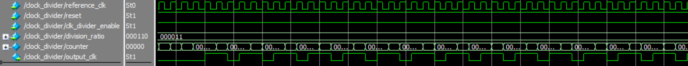

Test case (2) (division_ratio = 5)

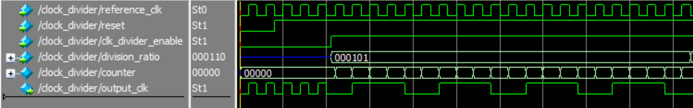

Test case (3) (division_ratio = 6)

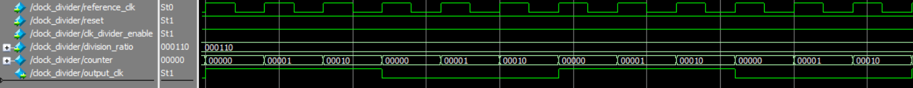

Test case (4) (division_ratio = 8)

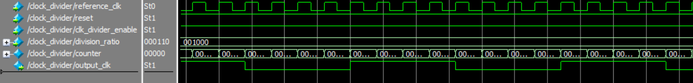

### Clock Gating Cell

#### Logic Diagram

Latch-based clock gating cell:

This module is replaced by the integrated clock gating cell (ICG) from the standard cell library. ICG is a full custom cell whose path delays are well balanced which eliminates the occurrence of pulse clipping and spurious clocking issues (those issues may occur only after fabrication due to imbalanced delays but not in simulation because ideally, the latch-based clock gating cell doesn't suffer from any clock issues). The replacement procedure is done automatically using the `place_ICG_cell.tcl` script to ease the process of placement (in the backend flow) and removal (in the functional simulation and verification) of the ICG cell.

#### Port Description

<table>
    <tr>
        <th align="left">Port</th>
        <th>Direction</th>
        <th>Width</th>
        <th>Description</th>
    </tr>
    <tr>
        <td>clk</td>
        <td>input</td>
        <td align="center">1</td>
        <td>The source clock to be gated (reference clock).</td>
    </tr>
    <tr>
        <td>clk_enable</td>
        <td>input</td>
        <td align="center">1</td>
        <td>An enable signal for the clock gating.</td>
    </tr>
    <tr>
        <td>gated_clk</td>
        <td>output</td>
        <td align="center">1</td>
        <td>The output gated clock (ALU clock).</td>
    </tr>
</table>

#### Functional Verification

This module is verified through logic simulation in Modelsim. The simulation can be run using `run.tcl` script.

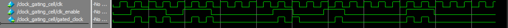

### ALU

#### Logic Diagram

'ALU result' logic diagram:

'ALU result valid' logic diagram:

#### Port Decription

<table>
    <tr>
        <th align="left">Port</th>
        <th>Direction</th>
        <th>Width</th>
        <th>Description</th>
    </tr>
    <tr>
        <td>clk</td>
        <td>input</td>
        <td align="center">1</td>
        <td>The ALU result is synchronized to this clock (reference clock).</td>
    </tr>
    <tr>
        <td>reset</td>
        <td>input</td>
        <td align="center">1</td>
        <td>Global active low asynchronous reset after synchronization.</td>
    </tr>
    <tr>
        <td>A</td>
        <td>input</td>
        <td align="center">DATA_WIDTH (default value is 8)</td>
        <td>ALU's first operand (it is connected to register_file[0]).</td>
    </tr>
    <tr>
        <td>B</td>
        <td>input</td>
        <td align="center">DATA_WIDTH (default value is 8)</td>
        <td>ALU's second operand (it is connected to register_file[1]).</td>
    </tr>
    <tr>
        <td>ALU_function</td>
        <td>input</td>
        <td align="center">4</td>
        <td>A binary code to determine the function of the ALU.</td>
    </tr>
    <tr>
        <td>enable</td>
        <td>input</td>
        <td align="center">1</td>
        <td>ALU enable signal.</td>
    </tr>
    <tr>
        <td>ALU_result_valid</td>
        <td>output</td>
        <td align="center">1</td>
        <td>A signal to indicate the ALU result is valid.</td>
    </tr>
    <tr>
        <td>ALU_result</td>
        <td>output</td>
        <td align="center">2 * DATA_WIDTH (default value is 16)</td>
        <td>The result of the ALU.</td>
    </tr>
</table>

#### Functional Verification

This module is verified through self-checking testbench in Modelsim. The testbench can be run using `run.tcl` script.

### Register File

#### Port Decription

<table>
    <tr>
        <th align="left">Port</th>
        <th>Direction</th>
        <th>Width</th>
        <th>Description</th>
    </tr>
    <tr>
        <td>clk</td>
        <td>input</td>
        <td align="center">1</td>
        <td>The read and write operations are synchronized to this clock (reference clock).</td>
    </tr>
    <tr>
        <td>reset</td>
        <td>input</td>
        <td align="center">1</td>
        <td>Global active low asynchronous reset after synchronization.</td>
    </tr>
    <tr>
        <td>address</td>
        <td>input</td>
        <td align="center">log2(REGISTER_FILE_DEPTH) (default value is 4)</td>
        <td>The address of the register to be read from or written to.</td>
    </tr>
    <tr>
        <td>write_enable</td>
        <td>input</td>
        <td align="center">1</td>
        <td>A signal to enable the write operation.</td>
    </tr>
    <tr>
        <td>write_data</td>
        <td>input</td>
        <td align="center">DATA_WIDTH (default value is 8)</td>
        <td>The data to be written in the given address.</td>
    </tr>
    <tr>
        <td>read_enable</td>
        <td>input</td>
        <td align="center">1</td>
        <td>A signal to enable the read operation.</td>
    </tr>
    <tr>
        <td>read_data_valid</td>
        <td>output</td>
        <td align="center">1</td>
        <td>A signal to indicate that the data on the 'read_data' bus is a valid data.</td>
    </tr>
    <tr>
        <td>read_data</td>
        <td>output</td>
        <td align="center">DATA_WIDTH (default value is 8)</td>
        <td>The data read from the given address.</td>
    </tr>
    <tr>
        <td>register0</td>
        <td>output</td>
        <td align="center">DATA_WIDTH (default value is 8)</td>
        <td>The first register in the register file, it stores the first operand of the ALU.</td>
    </tr>
    <tr>
        <td>register1</td>
        <td>output</td>
        <td align="center">DATA_WIDTH (default value is 8)</td>
        <td>The second register in the register file, it stores the second operand of the ALU.</td>
    </tr>
    <tr>
        <td>register2</td>
        <td>output</td>
        <td align="center">DATA_WIDTH (default value is 8)</td>
        <td>The third register in the register file, it stores the parity configuration (parity enable and parity type) of the UART.</td>
    </tr>
    <tr>
        <td>register3</td>
        <td>output</td>
        <td align="center">DATA_WIDTH (default value is 8)</td>
        <td>The fourth register in the register file, it stores the value of the oversampling prescale used in the clock divider (it is the ratio between the clock frequency of the UART receiver and the clock frequency of the UART transmitter).</td>
    </tr>
</table>

#### Functional Verification

This module is verified through self-checking testbench in Modelsim. The testbench can be run using `run.tcl` script.

### Bus Synchronizer
It acts as a gray encoded bus synchronizer or a single bit synchronizer according to the value of the BUS_WIDTH parameter. It consists of multiple registers (single bit or multiple bits) connected in a cascaded scheme, and the number of stages is parametrized with a default value of 2.

#### Logic Diagram

#### Port Description
<table>
    <tr>
        <th align="left">Port</th>
        <th>Direction</th>
        <th>Width</th>
        <th>Description</th>
    </tr>
    <tr>
        <td>clk</td>
        <td>input</td>
        <td align="center">1</td>
        <td>The clock of the destination domain.</td>
    </tr>
    <tr>
        <td>reset</td>
        <td>input</td>
        <td align="center">1</td>
        <td>Global active low asynchronous reset of the destination domain after synchronization.</td>
    </tr>
    <tr>
        <td>asynchronous_data</td>
        <td>input</td>
        <td align="center">BUS_WIDTH (default value is 1)</td>
        <td>The data to be synchronized (it is sent from another asynchronous domain to the destination domain).</td>
    </tr>
    <tr>
        <td>synchronous_data</td>
        <td>output</td>
        <td align="center">BUS_WIDTH (default value is 1)</td>
        <td>The data after synchronization to the destination domain.</td>
    </tr>
</table>

#### Functional Verification

This module is verified through a Python script which generates all the possible binary gray codes of a given size, the testbench reads the gray codes from the external file and waveform simulation is performed in Modelsim. The simulation can be run using `run.tcl` script.

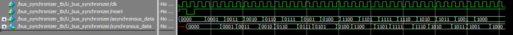

### Data Synchronizer

This module is used to synchronize any arbitrary bus by synchronizing its 'data valid' signal through a bit synchronizer then passing it through a pulse generator (flip-flop + NOT gate + AND gate) to produce a pulse whose width is the same as the width of destination domain. This pulse can be considered as a new 'data valid' signal synchronized to the destination domain and the data can be read safely from the 'asynchronous_data' port without the risk of entering metastability.

#### Logic Diagram

#### Port Description
<table>
    <tr>
        <th align="left">Port</th>
        <th>Direction</th>
        <th>Width</th>
        <th>Description</th>
    </tr>
    <tr>
        <td>clk</td>
        <td>input</td>
        <td align="center">1</td>
        <td>The clock of the destination domain.</td>
    </tr>
    <tr>
        <td>reset</td>
        <td>input</td>
        <td align="center">1</td>
        <td>Global active low asynchronous reset of the destination domain after synchronization.</td>
    </tr>
    <tr>
        <td>asynchronous_data_valid</td>
        <td>input</td>
        <td align="center">1</td>
        <td>A signal to indicate that the data on the 'asynchronous_data' bus is valid.</td>
    </tr>
    <tr>
        <td>asynchronous_data</td>
        <td>input</td>
        <td align="center">BUS_WIDTH (default value is 8)</td>
        <td>The data to be synchronized (it is sent from another asynchronous domain to the destination domain).</td>
    </tr>
    <tr>
        <td>Q_pulse_generator</td>
        <td>output</td>
        <td align="center">1</td>
        <td>The output of the pulse generator register.</td>
    </tr>
    <tr>
        <td>synchronous_data_valid</td>
        <td>output</td>
        <td align="center">1</td>
        <td>A signal to indicate that the synchronized data is valid.</td>
    </tr>
    <tr>
        <td>synchronous_data</td>
        <td>output</td>
        <td align="center">BUS_WIDTH (default value is 8)</td>
        <td>The data after synchronization to the destination domain.</td>
    </tr>
</table>

#### Functional Verification

This module is verified through self-checking testbench in Modelsim. The testbench can be run using `run.tcl` script.

### System Controller

This moudule consists of the two submodules (UART Transmitter Controller, UART Receiver Controller) in which the transmitter controller sends an enable signal to the receiver controller to prevent it from processing a frame sent from the UART receiver while there is another frame being sent through the UART transmitter.

#### UART Transmitter Controller

##### Finite State Machine (FSM)

This module consists of two FSMs:
<ol>
    <li>Main FSM: It controls the state which corresponds to which frame to send by the UART transmitter (e.g. TRANSMIT_REGISTER_FILE_DATA, TRANSMIT_LOWER_ALU_RESULT, TRANSMIT_UPPER_ALU_RESULT)</li>
    <li>Transmission FSM: It is used to determine the status of the transmission (e.g. NO_TRANSMISSION, TRANSMISSION_BEGAN, TRANSMISSION_ENDED). It is used in the Main FSM to transition its state when the transmission has ended.</li>
</ol>

Main FSM: This FSM controls the following output ports according to the current state: transmitter_parallel_data_valid, transmitter_parallel_data, UART_receiver_controller_enable.

The "WAIT_FOR_UPPER_ALU_RESULT" state is used so that the "transmitter_parallel_data_valid" can be set to logic zero during that state, this is done so that the pulse generator can accept a new "data_valid" signal (this is because when the "transmitter_parallel_data_valid" is high (because of the transmission of the lower ALU result), the output of the NOT gate of the pulse generator is low and it won't change its value until the "transmitter_parallel_data_valid" becomes low. After that, the output of the NOT gate is high and a new "data_valid" signal can be sent). To exit "WAIT_FOR_UPPER_ALU_RESULT" state, the output of the pulse generator register "Q_pulse_generator" must be low (to ensure that the zero that was sent during the "WAIT_FOR_UPPER_ALU_RESULT" state has reached the pulse generator) and then the upper ALU result can be sent with a new "data_valid" signal. Note that the "Q_pulse_generator" is asynchronous to the reference clock domain (i.e. it is generated by the UART transmitter clock) so a bit synchronizer is used to synchronize it to the reference clock domain.

Transmission FSM:

Note that if any omitted condition occurs, the current state won't change.

##### Port Description

<table>
    <tr>
        <th align="left">Port</th>
        <th>Direction</th>
        <th>Width</th>
        <th>Description</th>
    </tr>
    <tr>
        <td>clk</td>
        <td>input</td>
        <td align="center">1</td>
        <td>Reference clock.</td>
    </tr>
    <tr>
        <td>reset</td>
        <td>input</td>
        <td align="center">1</td>
        <td>Global active low asynchronous reset after synchronization.</td>
    </tr>
    <tr>
        <td>ALU_result_valid</td>
        <td>input</td>
        <td align="center">1</td>
        <td>A signal to indicate the ALU result is valid.</td>
    </tr>
    <tr>
        <td>ALU_result</td>
        <td>input</td>
        <td align="center">2 * DATA_WIDTH (defualt value is 16)</td>
        <td>The result of the ALU.</td>
    </tr>
    <tr>
        <td>read_data_valid</td>
        <td>input</td>
        <td align="center">1</td>
        <td>The data read from the given address from the register file.</td>
    </tr>
    <tr>
        <td>read_data</td>
        <td>input</td>
        <td align="center">DATA_WDITH (default value is 8)</td>
        <td>The data read from the given address from the register file.</td>
    </tr>
    <tr>
        <td>transmitter_busy_synchronized</td>
        <td>input</td>
        <td align="center">1</td>
        <td>The UART transmitter busy signal after synchronization.</td>
    </tr>
    <tr>
        <td>transmitter_Q_pulse_generator</td>
        <td>input</td>
        <td align="center">1</td>
        <td>The output signal of the pulse generator of the data synchronizer that synchronizes the UART transmitter data after being synchronized to the reference clock domain.</td>
    </tr>
    <tr>
        <td>transmitter_parallel_data_valid</td>
        <td>output</td>
        <td align="center">1</td>
        <td>A signal to indicate that there is new data to be transmitted.</td>
    </tr>
    <tr>
        <td>transmitter_parallel_data</td>
        <td>output</td>
        <td align="center">DATA_WIDTH (default value is 8)</td>
        <td>The data sent to the UART transmitter to transmit it serially.</td>
    </tr>
    <tr>
        <td>UART_receiver_controller_enable</td>
        <td>output</td>
        <td align="center">1</td>
        <td>A signal to enable the operation of the controller, this signal is used to prevent the processing of frames while there is another frame being sent by the UART transmitter.</td>
    </tr>
</table>

#### Functional Verification

This module is verified through self-checking testbench in Modelsim. The testbench can be run using `run.tcl` script.

#### UART Receiver Controller

This module controls the ALU control signals (ALU_function, ALU_enable, ALU_clk_enable) and register file control signals (address, write_enable, write_data, read_enable) based on the received frames from the UART receiver (i.e. according to the command to be executed).

##### Finite State Machine (FSM)

The "EVALUATE_RESULT" state is a dummy state whose function is to delay the return to the "IDLE" state for one cycle so that "ALU_clk_enable" signal goes high for one cycle after the ALU result is evaluated.

The waveform after executing an ALU operation is shown in the following figure.

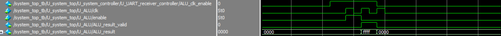

Note that if any omitted condition occurs, the current state won't change.

##### Port Description

<table>
    <tr>
        <th align="left">Port</th>
        <th>Direction</th>
        <th>Width</th>
        <th>Description</th>
    </tr>
    <tr>
        <td>clk</td>
        <td>input</td>
        <td align="center">1</td>
        <td>Reference clock.</td>
    </tr>
    <tr>
        <td>reset</td>
        <td>input</td>
        <td align="center">1</td>
        <td>Global active low asynchronous reset after synchronization.</td>
    </tr>
    <tr>
        <td>enable</td>
        <td>input</td>
        <td align="center">1</td>
        <td>A signal to enable the operation of the controller, this signal is used to prevent the processing of frames while there is another frame being sent by the UART transmitter.</td>
    </tr>
    <tr>
        <td>parallel_data_valid_synchronized</td>
        <td>input</td>
        <td align="center">1</td>
        <td>A synchrnoized signal to indicate that there exist new data received by the UART receiver.</td>
    </tr>
    <tr>
        <td>parallel_data_synchronized</td>
        <td>output</td>
        <td align="center">DATA_WIDTH (default value is 8)</td>
        <td>The data received by the UART receiver.</td>
    </tr>
    <tr>
        <td>ALU_function</td>
        <td>output</td>
        <td align="center">4</td>
        <td>A binary code to determine the function of the ALU.</td>
    </tr>
    <tr>
        <td>ALU_enable</td>
        <td>output</td>
        <td align="center">1</td>
        <td>A signal to enable the operation of the ALU.</td>
    </tr>
    <tr>
        <td>ALU_clk_enable</td>
        <td>output</td>
        <td align="center">1</td>
        <td>A signal to enable the clock gating cell which outputs the ALU clock.</td>
    </tr>
        <tr>
        <td>address</td>
        <td>output</td>
        <td align="center">log2(REGISTER_FILE_DEPTH) (defult value is 4)</td>
        <td>The address of the register to be read from or written to.</td>
    </tr>
    <tr>
        <td>write_enable</td>
        <td>output</td>
        <td align="center">1</td>
        <td>A signal to enable the read operation from the register file.</td>
    </tr>
    <tr>
        <td>write_data</td>
        <td>output</td>
        <td align="center">DATA_WIDTH (default value is 8)</td>
        <td>The data to be written in the given address in the register file.</td>
    </tr>
    <tr>
        <td>read_enable</td>
        <td>output</td>
        <td align="center">1</td>
        <td>A signal to enable the read operation in the register file.</td>
    </tr>
</table>

#### Functional Verification

This module is verified through self-checking testbench in Modelsim. The testbench can be run using `run.tcl` script.

### Reset Synchronizer

It is used to synchronize a global reset signal to different clock domains. It consists of multiple flip-flops connected in a cascaded scheme, and the number of stages is parametrized with a default value of 2.

#### Logic Diagram

#### Port Decription
<table>
    <tr>
        <th align="left">Port</th>
        <th>Direction</th>
        <th>Width</th>
        <th>Description</th>
    </tr>
    <tr>
        <td>clk</td>
        <td>input</td>
        <td align="center">1</td>
        <td>The clock of the destination domain.</td>
    </tr>
    <tr>
        <td>reset</td>
        <td>input</td>
        <td align="center">1</td>
        <td>Unsynchronized global active low reset.</td>
    </tr>
    <tr>
        <td>reset_synchronized</td>
        <td>output</td>
        <td align="center">1</td>
        <td>The reset signal after synchronization to the destination domain.</td>
    </tr>
</table>

#### Functional Verification

This module is verified through logic simulation in Modelsim. The simulation can be run using `run.tcl` script.

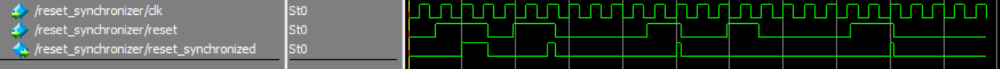

## Logic Synthesis

The whole system is synthesized using Synopsys Design Compiler and "TSMC 130nm CL013G-FSG Process
1.2V MetroTM v1.0" Standard Cell Library. There are 3 scripts that are used in the synthesis process:
<ol>
    <li>'constraints.tcl': It defines all clock source using 'create_clock' and 'create_generated_clock', defines asynchronous clock groups using 'set_clock_groups -asynchronous', sets input and output delays, sets the output load on the output ports, and sets the different operating conditions to be used in timing analysis (slow-slow library is used for setup analysis, fast-fast library is used for hold analysis).</li>
    <li>'logic_synthesis_script.tcl': It places the ICG instead of the RTL module, reads libraries, reads RTL modules, links and compiles the design, generates the reports, netlist, and SDF file, and replaces the ICG with the RTL module again (to be used in simulations).</li>
    <li>'run.sh': It runs the 'logic_synthesis_script.tcl' and produces the log file which contains all the steps of the synthesis and their outputs and cleans the directory from temporary files after the synthesis is done.</li>
</ol>

### Reports

#### Area

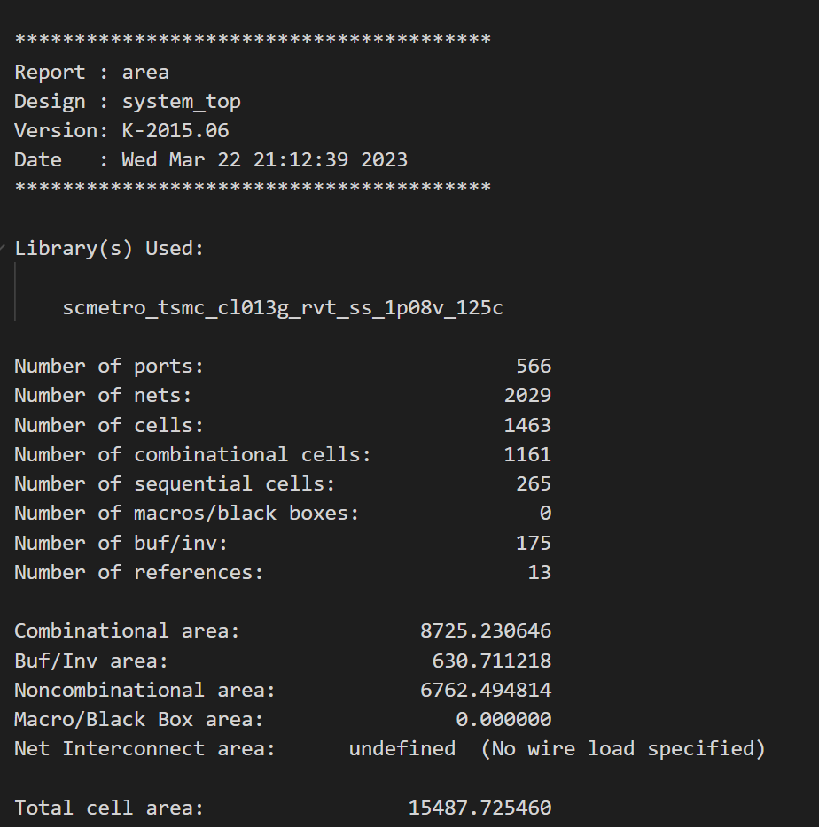

#### Clocks

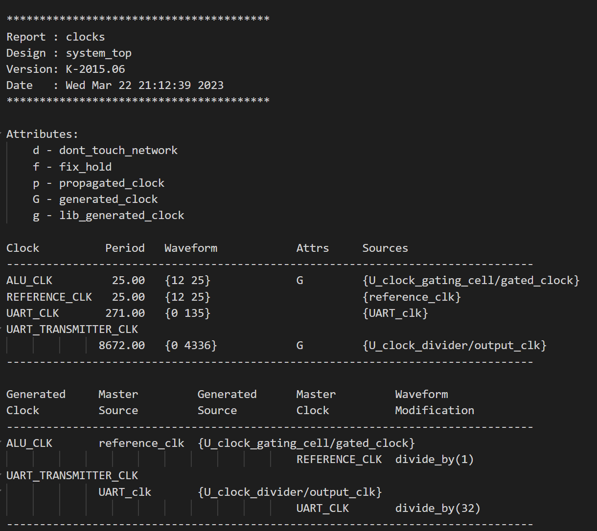

#### Power

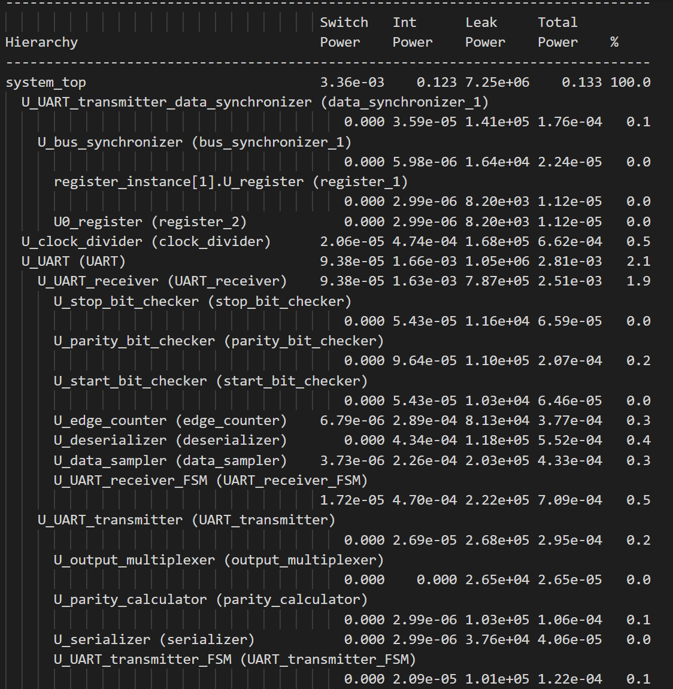

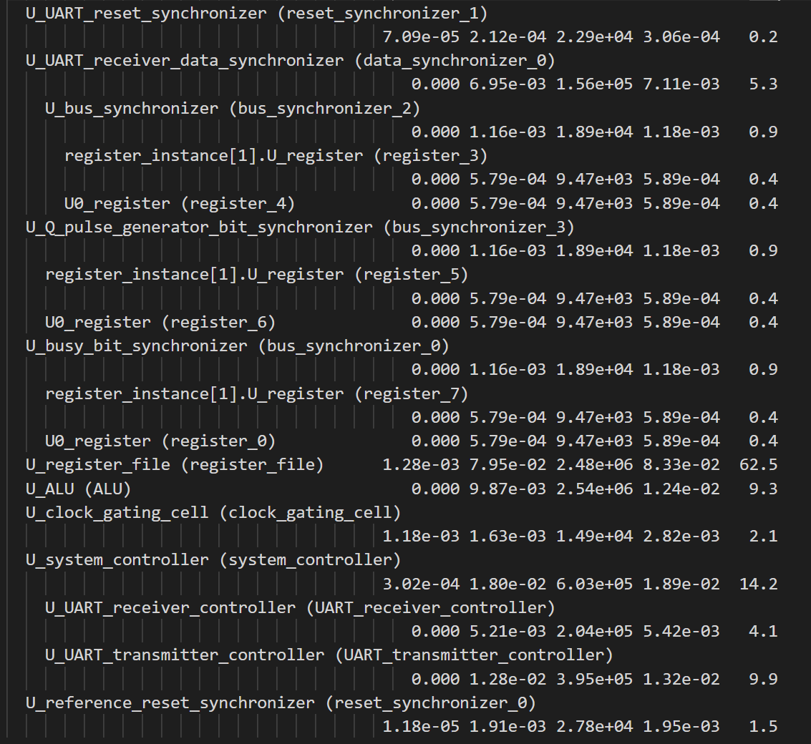

#### Timing reports (setup and hold) can be found at "logic_synthesis/logic_synthesis_output/reports"

## Post - Logic Synthesis Formal Verification

Formal verification takes the original RTL modules (golden RTL files) and the netlist generated fom the synthesis process and performs functional equivalence checking and reports whether the two systems (RTL and netlist) have the same functionality or not. The formal verification is run using Synopsys Formality. There are 2 scripts that are used in the formal verification process:
<ol>
    <li>'formal_verification_script.tcl': It places the ICG instead of the RTL module, reads libraries, reads golden RTL modules, reads the netlist generated from the synthesis process, compares the two designs, and replaces the ICG with the RTL module again (to be used in simulations).</li>
    <li>'run.sh': It runs the 'formal_verification_script.tcl' and produces the log file which contains all the steps of the formal verification and their outputs and cleans the directory from temporary files after the verification is done.</li>
</ol>

#### Verification Results

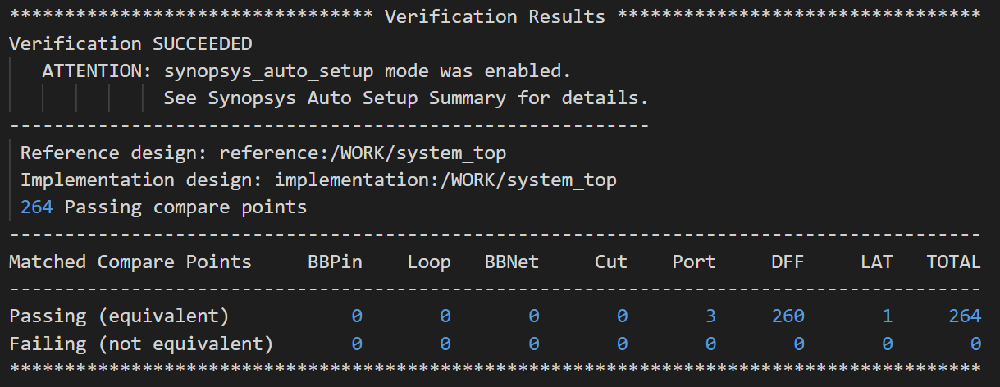

## Design For Testability (DFT)

DFT is used to insert additional logic (not for functional mode) to ensure that chip is free of manufacturing errors. The main concept is to create scan chains consisting of all registers in the system to be able to observe and control most of the nodes of the circuit (i.e. achieve high coverage). After DFT insertion, all the flip-flops (except shift registers) are replaced with scan flip-flops.

**DFT ports:**
<ul>
    <li>scan_clk: The clock which the system uses in test mode</li>
    <li>scan_reset: The reset which the system uses in the test mode</li>
    <li>SE: Scan enable signal, when SE = 1: all the registers in the scan chain acts as asingle shift register, when SE = 0: The output of the register passes through the combinational logic following it (this is used to to test nodes in the circuit). SE is connected to all the SE pins of all the scan flops.</li>
    <li>test_mode: A signal to indicate whether the chip is operating in the functional mode or the test mode.</li>
    <li>SI: The input to the scan chain. The width of this port is the number of the scan chains</li>
    <li>SO: The output from the scan chain. The width of this port is the number of the scan chains</li>
</ul>

**Number of scan chains:**
These results are produced after the logic synthesis indicating that there should exist 3 scan chains in the system if each chain has 100 flip-flops.

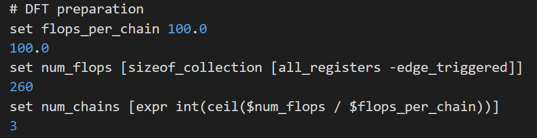

The logic of the scan_clk and scan_reset is manually inserted by using 2x1 muxes for all the clocks and resets in the system. The clock gating cell is bypassed by connecting its enable pin with (test_mode | enable) (i.e. the clock gating cell will be always enabled in the test mode). This leads to a violation on this cell because it is not controllable.

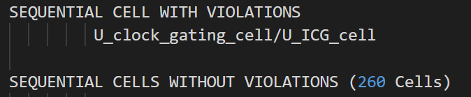

There are 3 modes of operation after the DFT logic is inserted:
<ol>
    <li>Functional mode: test_mode = 0, SE = 0</li>
    <li>Test scan mode: test_mode = 1, SE = 1</li>
    <li>Test capture mode: test_mode = 1, SE = 0</li>
</ol>

The whole system is synthesized and DFT insertion is performed using Synopsys DFT Compiler and "TSMC 130nm CL013G-FSG Process 1.2V MetroTM v1.0" Standard Cell Library. The synthesis and DFT insertion is repeated 3 times (once for each mode of operation) to ensure that there is no violations in any mode. There are 3 scripts that are used in the DFT insertion process:
<ol>
    <li>'constraints.tcl': Same constraints of the logic synthesis process but it additionaly defines the scan clock to be used in timing analysis</li>
    <li>'DFT_script.tcl': Same operations done in the logic synthesis process but it additionaly defines the DFT ports, identify the shift registers in the design so that they are not replaced with scan flip-flops, and insert DFT logic.</li>
    <li>'run.sh': It runs the 'DFT_script.tcl' 3 times by using the 'change_mode.py' script which changes the mode of operation automatically and produces the log file which contains all the steps of the synthesis and their outputs and cleans the directory from temporary files after the DFT insertion is done.</li>
</ol>

## Post - DFT Formal Verification

#### Verification Results

There exist 3 don't compare points which are the 3 output pins of the SO port, they are not verified because they doesn't exeist in the golden RTL files (i.e. their logic was automatically inserted by the DFT tool).

## Physical Design

### Import Design

In this step: the netlist generated from the DFT process, standard cells' lef file, technology lef file (6 metal layers are used), and system_top lef file (which specifies the layout of the whole system) are loaded. The MMMC (multi-mode multi-corner) constraints file is also loaded, this file defines the three modes of operations of the system (as explained in the DFT section) and also defines all the corners to be used in static timing analysis (the corners are defined by the fast-fast library and slow-slow library).

### Floor Planning

The chip size is 240.67x160.0 m2.

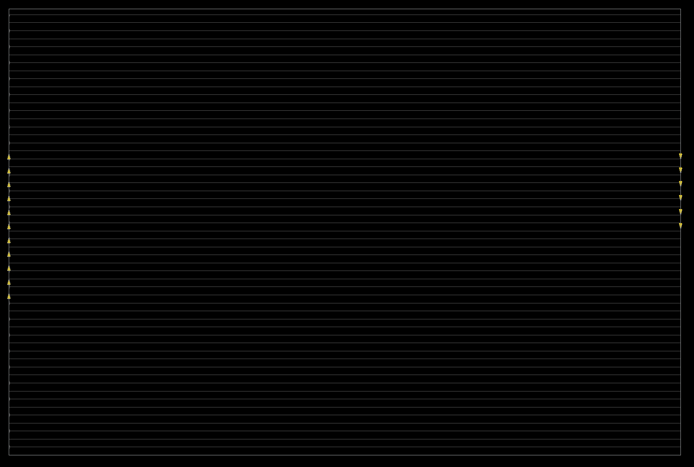

### Power Planning

The power planning step is performed to reduce the IR drop and minimize the effect of electromigration. In this step: power rings, power stripes, and power rails are inserted.

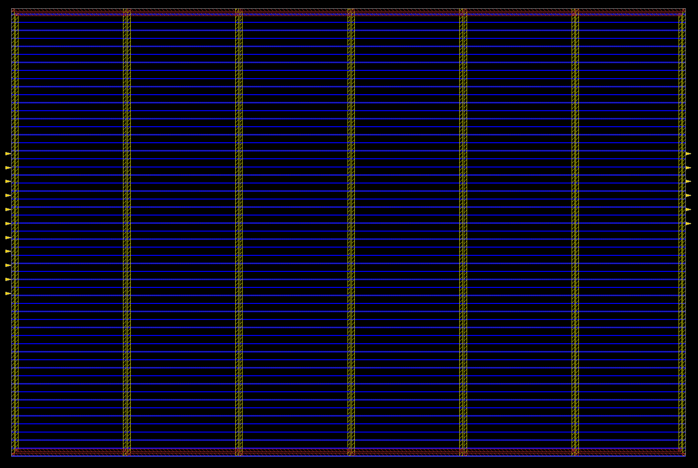

### Placement

Place the stanard cells and optimize if there is any timing violation.

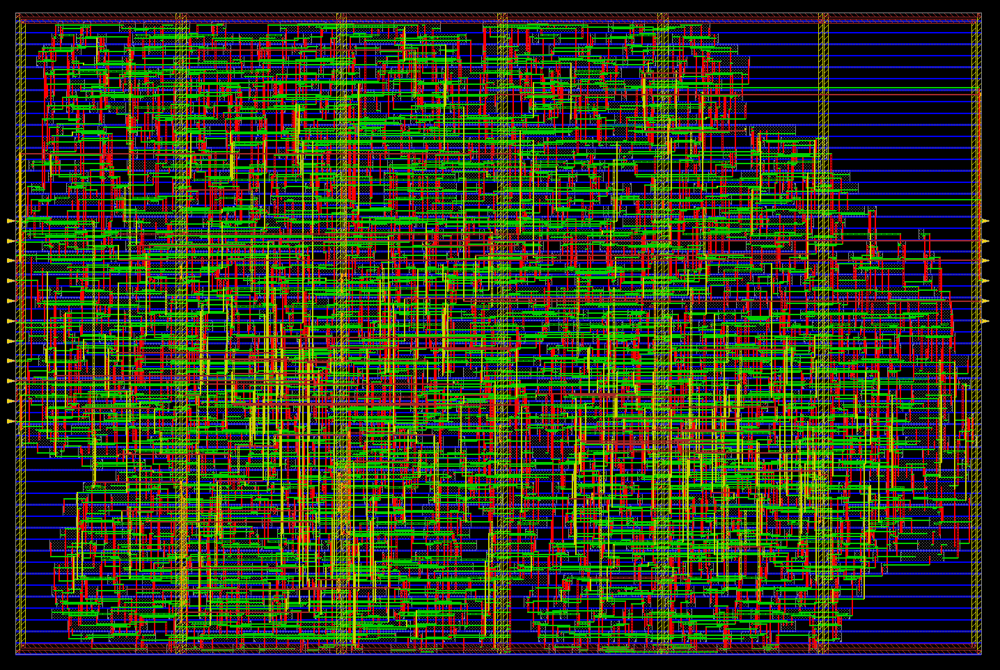

### Clock Tree Synthesis (CTS)

Build the clock tree to minimize the clock skew between registers and optimize if there is any timing violation.

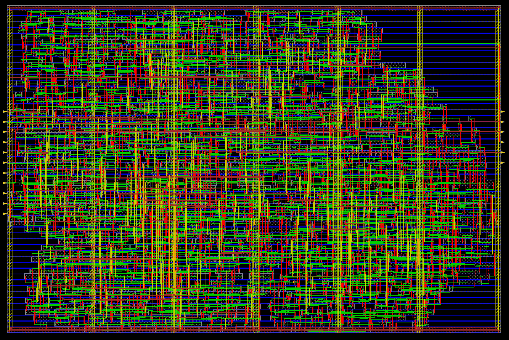

### Routing

Route the standard cells and optimize if there is any timing violation.

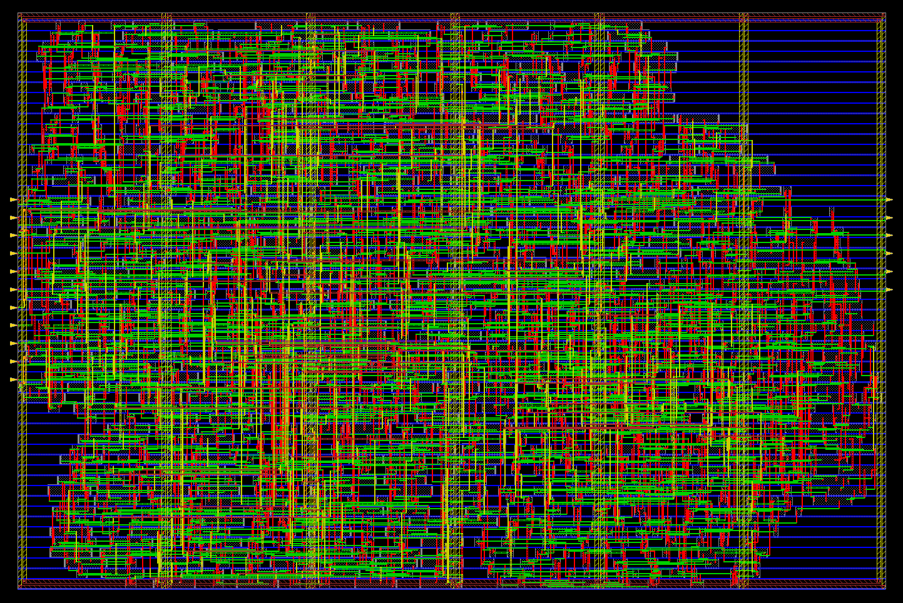

### Chip Finishing

Insert filler cells, generate gate level netlist (used in gate-level simulation (GLS)), gate level netlist with PG pins (used for analog IR drop simulation), SDF file (used in GLS), and GDS file which is used in manufacturing of the chip.

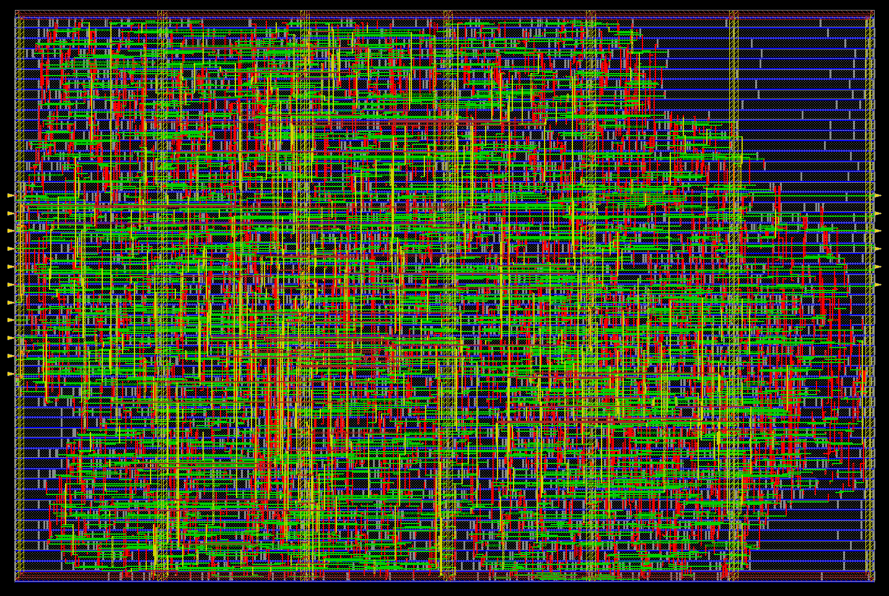

## Post - Physical Design Formal Verification

#### Verification Results

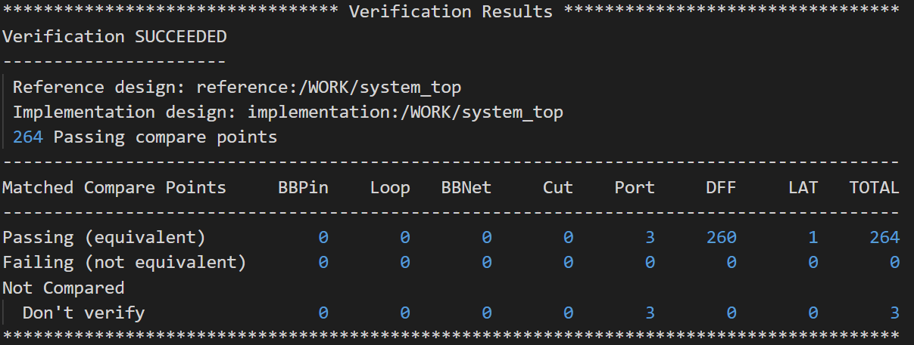

There exist 3 don't compare points which are the 3 output pins of the SO port, they are not verified because they doesn't exeist in the golden RTL files (i.e. their logic was automatically inserted by the DFT tool).

## Future Work

Gate-level simulation using:
<ol>
    <li>SDF file generated from the physical design process.</li>
    <li>Testbench used in the RTL functional verification.</li>
    <li>Gate-level netlist generated from the physical design process.</li>
    <li>Verilog standard cell library.</li>
</ol>
