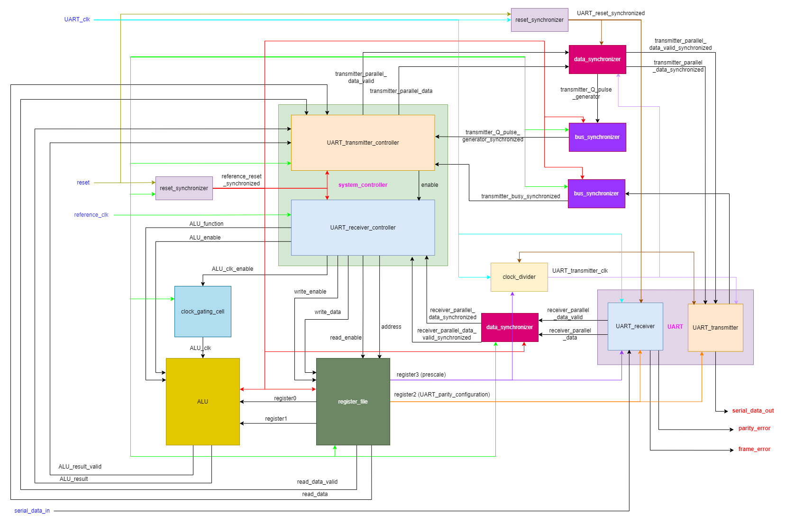
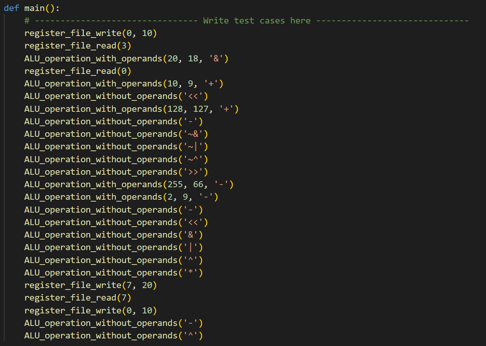
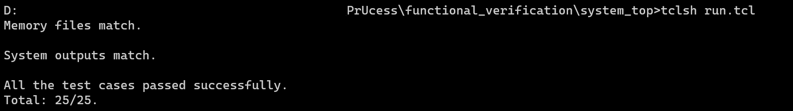

# PrUcess (Processing unit through UART)

## Introduction

Pr**U**cess is low-power multi-clock configurable digital **processing** system that executes commands (unsigned arithmetic operations, logical operations, register file read &amp; write operations) which are received from an external source through **UART** receiver module and it transmits the commands' results through the **UART** transmitter module.

This is a full ASIC design project (from RTL to GDS). It goes through the ASIC design flow from frontend to backend:
<ol>
    <li>System's architecture design.</li>
    <li>Synthesizable Verilog RTL modelling (behavioral modelling, structural modelling, and FSM coding) of all the system blocks from scratch (UART transmitter and receiver, integer clock divider, ALU, register file, parametrized data and bit synchronizers for solving CDC issues, reset synchronizer, and system's main controller).</li>
    <li>Solving CDC issues by using synchronizers.</li>
    <li>Functional verification using self-checking testbenches and automated Python verification environments and running the testbenches using Modelsim.</li>
    <li>Logic synthesis using Synopsys Design Compiler &amp; 130 nm technology node.</li>
    <li>Formal verification post logic synthesis using Synopsys Formality.</li>
    <li>Design for testability (DFT) using Synopsys DFT Compiler.</li>
    <li>Formal verification post DFT using Synopsys Formality.</li>
    <li>Physical design (floor planning, power planning, placement, CTS, routing, timing closure, and chip finishing) using Cadence innovus.</li>
    <li>Formal verification post physical design using Synopsys Formality.</li>
</ol>

## Table of Contents
1. [System's Specifications](#systems-specifications)
2. [System Top Level Module](#system-top-level-module)
3. [System Functional Verification](#functional-verification)

## System's Specifications

UART is a standard serial communication protocol widely used in many applications. Oversampling is a technique used in UART receivers to improve the accuracy and reliability of the received data. In a UART receiver, data is received as a series of binary bits that are transmitted asynchronously with respect to a clock signal. To correctly interpret the received data, the receiver must sample the incoming signal at the correct time to capture the correct value of each bit. Oversampling involves sampling the incoming signal at a higher frequency than the baud rate of the transmitted data. This means that multiple samples are taken during the transmission of each bit, allowing the receiver to more accurately determine the timing and value of each bit. Oversampling also helps to mitigate the effects of noise and other signal distortions that can cause errors in the received data. By taking multiple samples of each bit, the receiver can detect and correct for these errors, improving the overall reliability of the data transmission.

The system includes two asynchronous clock domains (reference clock domain and UART clock domain). The command is received by the UART receiver, then it is sent to the system controller through a synchronizer (to solve the CDC issues) to decode and execute the command and then it sends the result to the UART transmitter through a synchronizer which will finally transmit it serially.

#### System's Parameters

<table>
    <tr>
        <th align="left">Parameter</th>
        <th>Default Value</th>
        <th>Description</th>
    </tr>
    <tr>
        <td>DATA_WIDTH</td>
        <td align="center">8</td>
        <td>It is the size of: registers, ALU operands, UART transmitter frames, and UART receiver frames.</td>
    </tr>
    <tr>
        <td>REGISTER_FILE_DEPTH</td>
        <td align="center">16</td>
        <td>The number of registers in the register file.</td>
    </tr>
    <tr>
        <td>SYNCHRONIZER_STAGE_COUNT</td>
        <td align="center">2</td>
        <td>The number of stages in a synchronizer.</td>
    </tr>
    <tr>
        <td>oversampling_prescale</td>
        <td align="center">the default value after resetting the system is 8</td>
        <td>The ratio between the frequency of the UART receiver clock and the frequency of the UART transmitter clock.</td>
    </tr>
</table>

#### System's Clock Domains

<table>
    <tr>
        <th align="left">Clock Domain</th>
        <th>Clock Names</th>
        <th>Modules</th>
        <th>Frequency</th>
    </tr>
    <tr>
        <td>Reference clock domain</td>
        <td>
            <ul>
                <li>reference_clk</li>
                <li>ALU_clk</li>
            </ul>
        </td>
        <td>
            <ul>
                <li>System controller</li>
                <li>ALU</li>
                <li>Register file</li>
            </ul>
        </td>
        <td align="center">Reference clock frequency = ALU clock frequency = 40 MHz</td>
    </tr>
    <tr>
        <td>UART clock domain</td>
        <td>
            <ul>
                <li>UART_clk</li>
                <li>UART_transmitter_clk</li>
            </ul>
        </td>
        <td>
            <ul>
                <li>UART transmitter</li>
                <li>UART receiver</li>
                <li>Clock divider</li>
            </ul>
        </td>
        <td align="center">
            <ul>
                <li>UART transmitter clock frequency = 115.2 KHz (standard baud rate)</li>
                <li>UART clock frequency = oversampling_prescale * 115.2 KHz = 32 * 115.2 KHz = 3.6864 MHz</li>
            </ul>
        </td>
    </tr>
</table>

Note that the oversampling prescale can have the values (8, 16, or 32) but 32 is used in the simulations and backend flow to ensure that the UART receiver is functioning correctly in the worst case (highest clock frequency).

#### System's Components:
<ol>
    <li>UART: It consists of UART receiver which receives the commands and UART transmitter that transmits the commands' results.</li>
    <li>Clock divider: An integer clock divider which can divide the source clock up to division ratio of 32. It is used to divide the UART clock to produce UART transmitter clock with division ratio equal oversampling prescale.</li>
    <li>ALU: It executes unsigend arithmetic operations and logical operations.</li>
    <li>Clock gating cell: It is used to gate the ALU clock because there is significant time in which the ALU is not in operation (because the ALU operates on a very fast clock compared with the UART, so it waits long time to receive a new command).</li>
    <li>Register file.</li>
    <li>System controller: It is the main controller of the system. It consists of UART transmitter controller and UART receiver controller. The UART transmitter controller controls the UART transmitter by sending to it the data to be sent serially after it is ready (ALU result or register file data). The UART receiver controller controls the ALU and register file control signals based on the received frames from the UART receiver.</li>
    <li>Reset synchronizer: It is used to synchronize the global reset to all clock domains.</li>
    <li>Bus synchronizer: This module can be used to synchronize a single bit or a grey encoded bus between two asynchronous clock domains. It is a generic module (setting BUS_WIDTH = 1, means that it is a single bit synchronizer).</li>
    <li>Data synchronizer: It is used to synchronize a bus by using a bit synchronizer and pulse generator to synchronize the bus's data valid signal.</li>
</ol>

#### ALU Operations:
<ol>
    <li>Addition (+)</li>
    <li>Subtraction (-)</li>
    <li>Multiplication (*)</li>
    <li>Division (/)</li>
    <li>Bit-wise AND (&)</li>
    <li>Bit-wise OR (|)</li>
    <li>Bit-wise NAND (~&)</li>
    <li>Bit-wise NOR (~|)</li>
    <li>Bit-wise XOR (^)</li>
    <li>Bit-wise XNOR (~^)</li>
    <li>Is equal (==)</li>
    <li>Is greater than (>)</li>
    <li>Is less than (<)</li>
    <li>Shift right (>>1)</li>
    <li>Shift left (<<1)</li>
</ol>

#### System's Commands:
<ul>
    <li>Register file write command. This command consists of 3 frames as follows: 
        <ol>
            <li>Command opcode (0xAA)</li>
            <li>Register file write address</li>
            <li>Register file write data</li>
        </ol>
    </li>
    <li>Register file read command. This command consists of 2 frames as follows: 
        <ol>
            <li>Command opcode (0xBB)</li>
            <li>Register file read address</li>
        </ol>
    </li>
    <li>ALU operation with operands command. The operands of the ALU are connected to the first two registers of the register file, so to execute this command: the operands are first written to the first two registers in the register file then the result is evaluated. This command consists of 4 frames as follows: 
        <ol>
            <li>Command opcode (0xCC)</li>
            <li>Operand A</li>
            <li>Operand B</li>
            <li>ALU function</li>
        </ol>
    </li>
    <li>ALU operation without operands command. This command executes the ALU operation on the stored values in the first two registers in the register file directly. This command consists of 2 frames as follows: 
        <ol>
            <li>Command opcode (0xDD)</li>
            <li>ALU function</li>
        </ol>
    </li>
</ul>

In all ALU commands, the UART transmitter sends two consecutive frames (becuase the size of the ALU result is double the size of the frame).

#### System's Configurations
<ul>
    <li>The parity configuration of UART (parity enable and parity type).</li>
    <li>The oversampling prescale (division ratio) of the UART receiver.</li>
</ul>

Note that the mentioned configurations are outputs from the register file (reference clock domain) and they are inputs to blocks that operates on UART clock (i.e. Metastability may occur becuase the source and destination domains are asynchronous to one another), however there is no synchronizers used to synchronize those signals because they are **Quasi-static signals** (they are effectively stable for long periods of time. Such domain crossings do not require synchronizers in the destination domain, because they are held long enough to be captured by even the slowest clock domains without the risk of metastability).

## System Top Level Module

### Block Diagram

Blue-colored signals are the system's input ports, while red-colored signals are the system's output ports.

#### Port Description

<table>
    <tr>
        <th align="left">Port</th>
        <th>Direction</th>
        <th>Width</th>
        <th>Description</th>
    </tr>
    <tr>
        <td>reference_clk</td>
        <td>input</td>
        <td align="center">1</td>
        <td>The main clock of the system.</td>
    </tr>
    <tr>
        <td>UART_clk</td>
        <td>input</td>
        <td align="center">1</td>
        <td>UART clock (the clock of the UART receiver).</td>
    </tr>
    <tr>
        <td>reset</td>
        <td>input</td>
        <td align="center">1</td>
        <td>Unsynchronized global active low asynchronous reset.</td>
    </tr>
    <tr>
        <td>serial_data_in</td>
        <td>input</td>
        <td align="center">1</td>
        <td>The data which is received serially by the UART receiver.</td>
    </tr>
    <tr>
        <td>serial_data_out</td>
        <td>output</td>
        <td align="center">1</td>
        <td>The output of the UART transmitter (It is also the output of the mux that select between start, serial data, parity, or stop bits according to the state of the transmission).</td>
    </tr>
    <tr>
        <td>parity_error</td>
        <td>output</td>
        <td align="center">1</td>
        <td>A signal to indicate that there is parity mismatch between the received parity bit and the calculated parity bit.</td>
    </tr>
    <tr>
        <td>frame_error</td>
        <td>output</td>
        <td align="center">1</td>
        <td>A signal to indicate that the start bit or the stop bit was incorrect.</td>
    </tr>
</table>

### Functional Verification

The whole system is verified through an automated Python environment which does the following:
<ol>
    <li>Generates the opcodes of all the given commands in an external file.</li>
    <li>Generates all the expected results that should be transmitted serially through the UART transmitter in an external file.</li>
    <li>Generates the memory file which corresponds to the final values that should be stored in the register file after the execution of all the commands.</li>
    <li>Compares the results of the Verilog testbench (transmitted through UART transmitter) and the generated memory file with the expected results' file and expected memory file.</li>
    <li>Reports any mismatch that occur in the testbench.</li>
    <li>Reports the number of passed and failed testcases.</li>
</ol>

Sample test cases:
Any arbitrary test case can be written in `functional_verification/system_top/test_cases_generator.py` as the following:

Then the script `functional_verification/system_top/run.tcl` is used to: run the Python script to generate the expected results, run the testbench to generate the actual results, and compare both the results to report any mismatch in the results.

